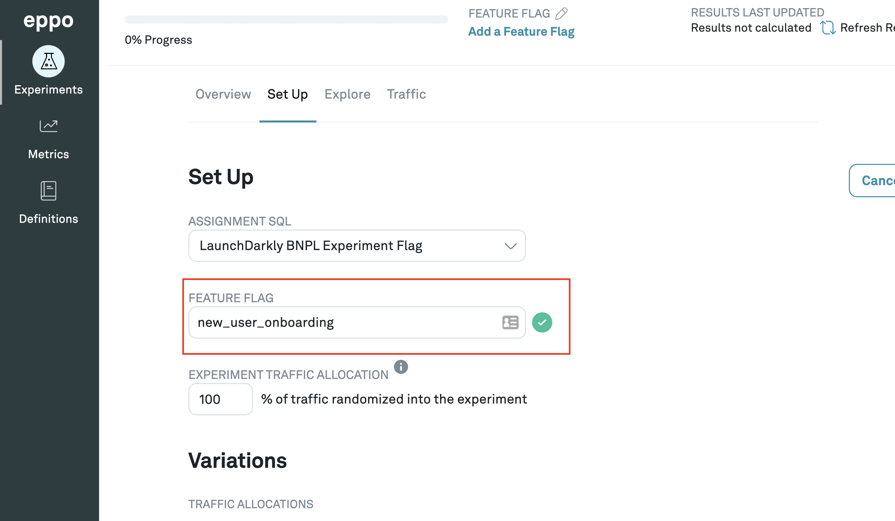

# Creating experiments

Experiments are a set of metrics that correspond to users being shown different feature sets that you would like to track over time.

1. Navigate to **Experiments** in the left-hand menu and click **+Experiment**

2. Fill out the **Create Experiment** Form

Give your experiment a name, start and end date. You can also choose to set an event analysis period that is different from your assignment period. This is useful if you want to analyze the impact of an experiment on long-term metrics.

3. Navigate to the **Set Up** tab and click the **Configure the Experiment** button

6. Select an assignment SQL from the definitions you created

7. Input feature flag name

When you created your assignment SQL, you should have made note of your feature flag name. In our case it's `new_user_onboarding`.

8. Input what percentage of traffic you want randomized into the experiment.

If you input 100%, 100% of the relevant entities (users in this case) will be included in the experiment.

9. Add the variants

When you created your assignment SQL, you should have made note of your variant names. In our case here it's `control` and `variant`.

You can go ahead and add each variant into the experiment here.

10. Select the traffic allocation you would like

The default is an even split between all the variants (including control), but you can also customize the allocation for unequal splits.

11. Click **Save Changes**
