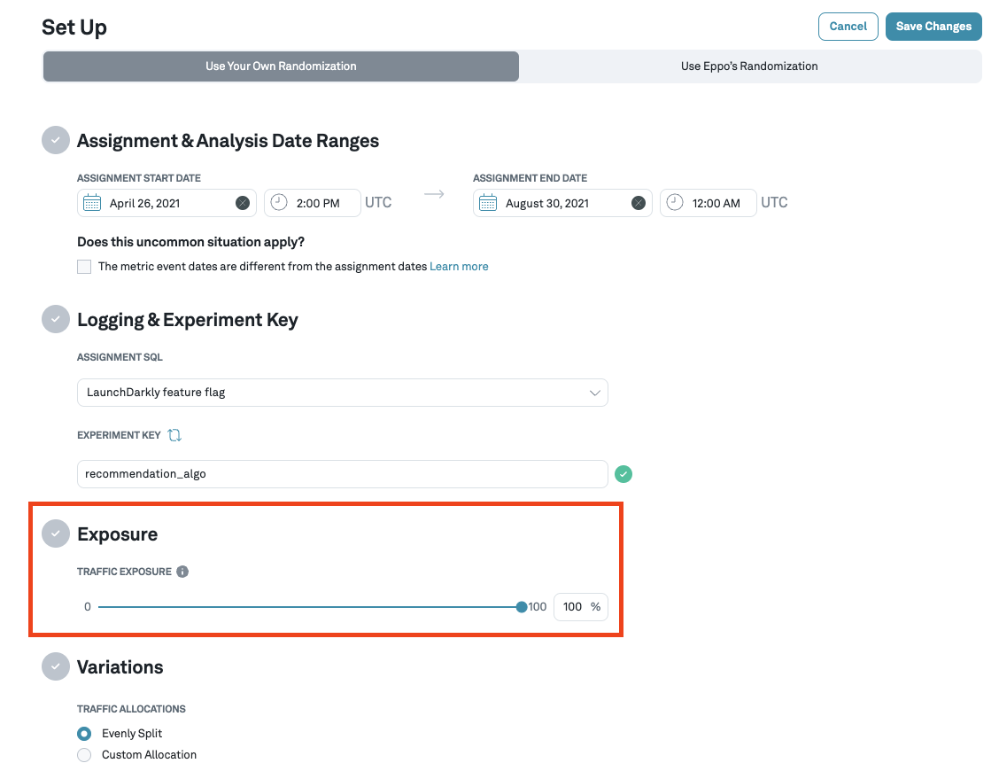

# Traffic and traffic imbalances

Navigate to the **Experiments** page by clicking on the **Experiments** icon from the left tab and then from the list, click on the experiment that you are interested in. The details page for each experiment contains a **Set Up** tab where you can configure the % of traffic you want to randomize into the experiment.

The **Traffic** tab shows you a comparison of the traffic seen between the variants being considered for the experiment. You can also toggle between seeing the cumulative, or daily traffic.

You can also see how the actual traffic differs from the actual traffic you were expecting to see. If there is an imbalance, you will see a warning next to the tab and above the graph.

