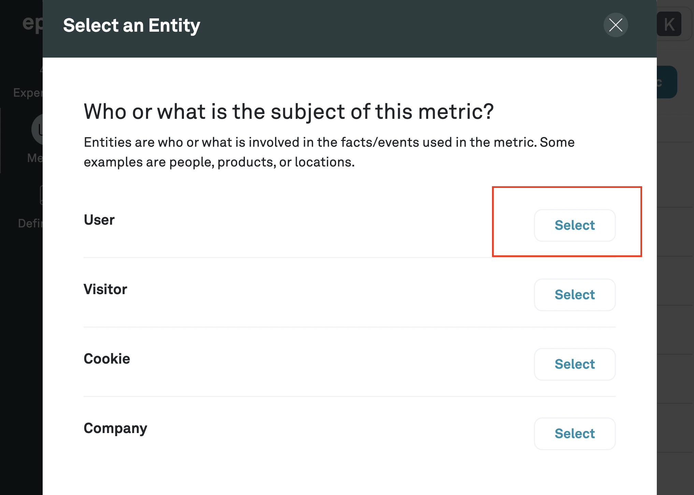

# Creating a Metric

Metrics are statistics like Revenue or Signups that you are interested in tracking in your experiment

1. Navigate to **Metrics** and Click **+Metric**

2. Select the subject of the User SQL

**User** is the default entity in Eppo, but you can also create a custom entity and select it here.

4. Select a fact

This should be one of the facts that you created in the step above, and should correspond to a metric that you want to track in an experiment.

5. Select an aggregation

The aggregation will aggregate over whatever the fact is measuring on a per-entity basis. So for example, if you select the `Revenue` fact and the `SUM` aggregation, the metric will be the total revenue for each user;, if you select the `Upgrades` fact and the `SUM` aggregation, the metric will be the total number of upgrades for each user, which should only be 1 across the board.

Eppo supports the following aggregations:

- SUM
- COUNT DISTINCT
- COUNT
- RETENTION
- CONVERSION

6. (Optional) Select a Filter

When you created an assignment SQL above, you may have also created additional dimensions, i.e. country or browser. These dimensions are now available under the **Definitions** > **Dimensions SQL**.

Here, you can filter on any of those dimensions. In the example above, we just want to focus on upgrades from Canada.

7. Select a minimum detectable effect

The minimum detectable effect refers to the smallest effect you want to reliably detect in experiments. The higher the minimum detectable effect you set, the longer the experiment will take to reach conclusive results.

