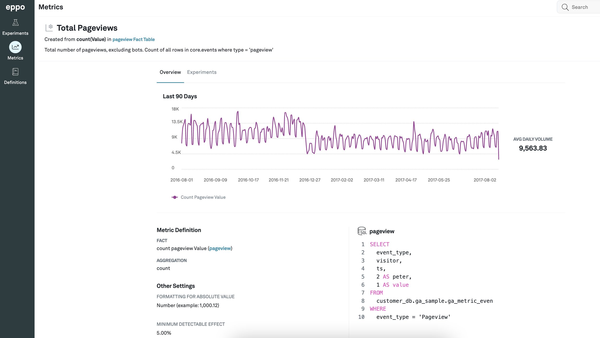
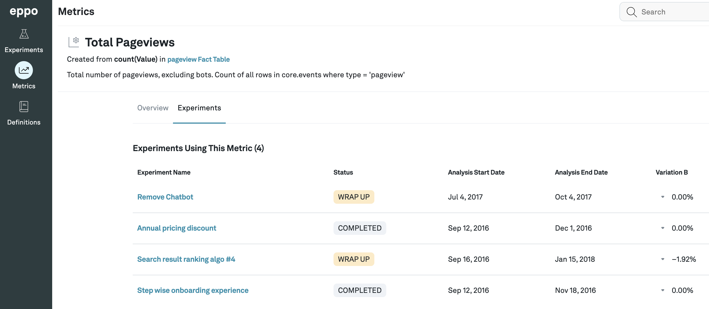

# Metric detail view

If you click on any metric listed under the **Metrics** tab, you can see more details about it. The details page consists of two tabs: **Overview** and **Experiments**.

The **Overview** tab contains a graph of the metric value against time along with an average for that time period. It details the fact and aggregation being used and the minimum detectable effect set for that metric. It also shows the SQL query being used to calculate that metric.

The **Experiments** tab shows a list of all the experiments that are considering this metric. This is helpful when you want to see what which ongoing experiments may be affecting a particular metric you care about.

