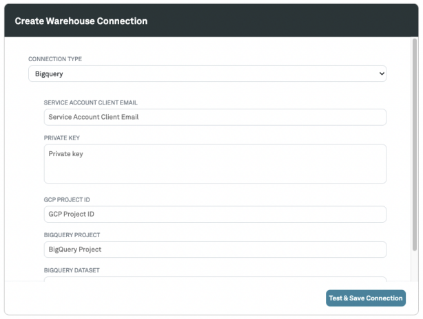

# Connecting to BigQuery

## Create a Service Account

1. Log into your GCP console.
2. Open the Navigation menu.
3. Hover over **IAM & Admin** and select **Service Accounts** from the submenu.
4. Click **CREATE SERVICE ACCOUNT** in the service accounts header.
5. Under **Service account details**, add an _account name_, _ID_, and optional _description_.
6. Click **CREATE**.
7. Under **Service account permissions**, add the following role: `BigQuery Job User (roles/bigquery.jobUser)`
8. Click **CONTINUE**.
9. (optional) Under **Grant users access** you may choose to grant other users access to your new service account.
10. Click **CREATE KEY** to create a json [private key](https://cloud.google.com/iam/docs/creating-managing-service-account-keys).
    A file will be downloaded to your computer, which you will later use when connecting to
    Eppo.

## Create Sandbox Dataset for Eppo

1. In BigQuery SQL Editor, create a new dataset in the appropriate project:

```sql
CREATE SCHEMA IF NOT EXISTS `<project>.eppo_output`;
```

2. Grant role _BigQuery Data Owner_ to the Eppo Service Account on the new dataset:

```sql
GRANT `roles/bigquery.dataOwner`
ON SCHEMA `<your-project>`.`eppo_output`
TO "serviceAccount:<service_account_name>@<project>.iam.gserviceaccount.com";
```

3. Grant the Eppo Service Account read-access to your data:

```sql
GRANT `roles/bigquery.dataViewer`
ON SCHEMA `<your-project>`.`<your-dataset>`
TO "serviceAccount:<service_account_name>@<project>.iam.gserviceaccount.com";
```

If you would like to provide more granular access, you can provide us with read-only access to specific tables or views by following to instructions [here](https://cloud.google.com/bigquery/docs/table-access-controls-intro).

## Enter credentials into Eppo

1. Open the JSON file created in Step 10 under _Create a Service Account_
2. Enter the values into the form fill as shown below, then click **Test and Save Connection**
   
3. Eppo users [Google Secret Manager](https://cloud.google.com/secret-manager) to store and manage your credentials. Credentials are never stored in plaintext, and Secret Manager can only be accessed via authorized roles in GCP, where all usage is monitored and logged.
