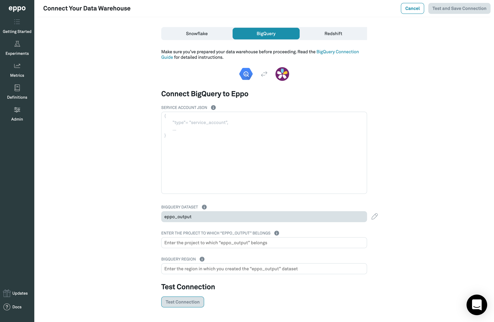

# BigQuery

## Preparing your warehouse for Eppo

Before you connect Eppo to your data warehouse, it is recommended that you create a Service Account for Eppo. This Service Account should then be used to connect Eppo to your warehouse.

Additionally, you will need to create a data environment for Eppo to write intermediary tables to, as well as grant the Service Account read access to tables you'd like Eppo to query SQL definitions from.

### 1. Create a Service Account

1. Log into your GCP console.
2. Open the Navigation menu.
3. Hover over **IAM & Admin** and select **Service Accounts** from the submenu.
4. Click **CREATE SERVICE ACCOUNT** in the service accounts header.
5. Under **Service account details**, add an _account name_, _ID_, and optional _description_.
6. Click **CREATE**.
7. Under **Service account permissions**, add the following role: `BigQuery Job User (roles/bigquery.jobUser)`
8. Click **CONTINUE**.
9. (optional) Under **Grant users access** you may choose to grant other users access to your new service account.
10. Click **CREATE KEY** to create a json [private key](https://cloud.google.com/iam/docs/creating-managing-service-account-keys).
    A file will be downloaded to your computer, which you will later use when connecting to
    Eppo.

### 2. Create Sandbox Dataset for Eppo

1. In the BigQuery SQL Editor, create a new dataset in the appropriate project:

```sql
CREATE SCHEMA IF NOT EXISTS `<project>.eppo_output`;
```

2. Grant role _BigQuery Data Owner_ to the Eppo Service Account on the new dataset:

```sql
GRANT `roles/bigquery.dataOwner`
ON SCHEMA `<your-project>`.`eppo_output`
TO "serviceAccount:<service_account_name>@<project>.iam.gserviceaccount.com";
```

3. Grant the Eppo Service Account read-access to your data:

```sql
GRANT `roles/bigquery.dataViewer`
ON SCHEMA `<your-project>`.`<your-dataset>`
TO "serviceAccount:<service_account_name>@<project>.iam.gserviceaccount.com";
```

If you would like to provide more granular access, you can provide us with read-only access to specific tables or views by following the instructions [here](https://cloud.google.com/bigquery/docs/table-access-controls-intro).

## Connecting your Warehouse to Eppo

Now that you have a proper Service Account created for Eppo with adequate privileges, you can use it to connect Eppo to your warehouse.

### Initial Configuration of Credentials

1. Open the JSON file created in Step 10 under _Create a Service Account_
2. Log in to your Eppo account at [eppo.cloud](https://eppo.cloud/)
3. Click the `Getting Started` button in the top-right corner. Once on that screen, and within the `Connect your Warehouse` tab, click the `Connect your data warehouse to Eppo` button in the bottom right-hand corner of the screen.
4. Once on the data warehouse connection screen, click the `BigQuery` tab. From there, you should be prompted to enter all of the necessary information for doing so. This information includes:

 - **Service Account JSON** - From step 10 above
 - **BigQuery Dataset** - `eppo_output`
 - **BigQuery Project** - Name of the BQ project to which `eppo_output` belongs
 - **BigQuery Region** - The region in which you created the `eppo_output` dataset

5. Enter the values into the form (which should look like the screenshot below), then click `Test Connection`. Once this test succeeds, save your settings by clicking `Test and Save Connection`.



**Note**: Eppo uses [Google Secret Manager](https://cloud.google.com/secret-manager) to store and manage your credentials. Credentials are never stored in plaintext, and Secret Manager can only be accessed via authorized roles in GCP, where all usage is monitored and logged.

### Updating Credentials

Credentials can be updated at any time within the Admin panel of the app.
