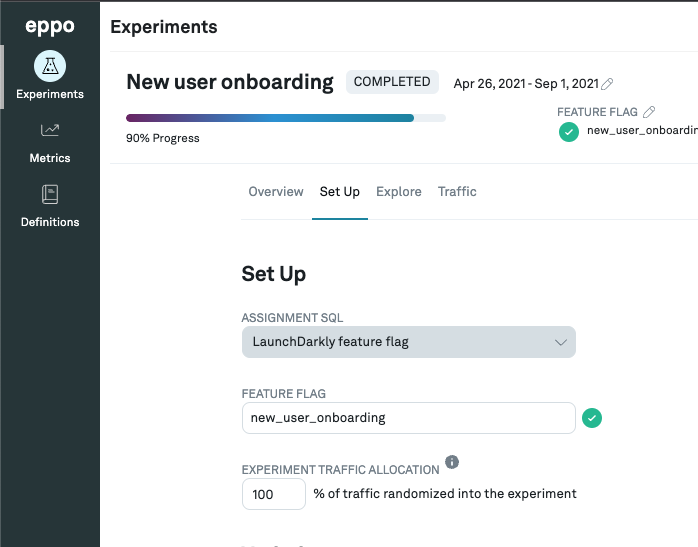
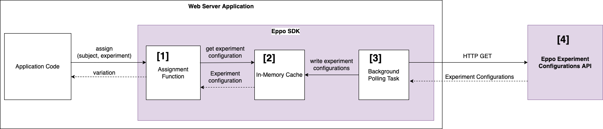

import Tabs from '@theme/Tabs';
import TabItem from '@theme/TabItem';

# Create assignment tables with Eppo Randomization SDK

# Overview

You can use Eppo’s SDK to randomly assign subjects to your Eppo experiment variations. As an example, consider an experiment for testing a UI background color with two variants - "treatment" and "control". Users (subjects) in the "treatment" group see a dark background, users in the "control" group see a white background. Your application code might do something like this to determine the background color:

```python
def get_background_color(user):
	variation = get_variant(user)
	if variation == 'treatment':
		return 'DARK'
	else:
		return 'WHITE'
```

Eppo’s SDK handles the variation assignment for you. Given a user subject and experiment, the SDK assigns a variation based on your experiment traffic allocation and variations configured in Eppo. If the traffic allocation changes, subjects already assigned to a variation are not reassigned.

# Getting Started

## Generating an API Token

You will need to generate an API token that allows your application to communicate with Eppo’s experiments API. Do not share your API token with anyone outside your organization.

(I linked the loom video here, but in the docs website we should have step-by-step guide with screenshots.)

Loom: [https://www.notion.so/eppo/WIP-SDK-Developer-Documentation-7969949576a0432ab1db43887f0dd623#bb4fb2a82ea04691951835de094fc61e](https://www.notion.so/DRAFT-SDK-Developer-Documentation-7969949576a0432ab1db43887f0dd623)

## Install the SDK package in your preferred language

:::note
Eppo’s Node SDK is meant for use in server applications only. It is not compatible with browser or client JS applications.
:::

<Tabs>
<TabItem value="node" label="Node">

```bash
yarn add @eppo/node-server-sdk
```

</TabItem>
<TabItem value="python" label="Python">

```bash
pip install eppo-server-sdk
```
</TabItem>
</Tabs>


## Initializing the Eppo Client in your application code

Initialize the SDK once when your application starts up to generate a shared client instance. Upon initialization, the SDK will begin polling Eppo’s API at regular intervals to retrieve your experiment configurations.

:::note
The client must be a singleton. The client instance stores assignment configurations in memory. The same client instance should be reused for the lifetime of your application. Do not generate a new instance on every request.
:::

<Tabs>
<TabItem value="node" label="Node">

```tsx
import * as EppoSdk from '@eppo/node-server-sdk';

const eppoClient = EppoSdk.init({ apiKey: 'YOUR_API_KEY' });
```

</TabItem>
<TabItem value="python" label="Python">

```python
import eppo_client
from eppo_client.config import Config

client_config = Config(api_key="<YOUR_API_KEY>")
client = eppo_client.init(client_config)
```

</TabItem>
</Tabs>


## Retrieving Assignment Configurations

Each SDK client exposes a variation assignment function. This function takes 2 inputs:

- `experimentKey` - this is the value from the “Feature Flag” input on the Experiment “Setup” tab as seen in the below screenshots
- `subject` - the user or entity that is being experimented on, typically represented by a uuid.

For the SDK to assign an experiment variation to a subject, both of the following must be true:

1. The experiment must be running. Look for a **RUNNING** status in the Eppo UI.


2. The experiment must have a non-zero **Experiment Traffic Allocation**



If the above conditions are NOT true, you may still initialize the SDK in your application, but the variation assignment function will return `null` for the inactive experiment. The assignment function will also return `null` if the `subject` input does not belong to the experiment sample population. For example, if the traffic allocation is 25%, the assignment function will return a variation for 25% of subjects and `null` for the remaining 75%.

See the below language-specific examples for how to invoke the assignment function:

<Tabs>
<TabItem value="node" label="Node">


```tsx
// assumes 'client' is stored by your app as a singleton or global variable

const variation = client.getAssignment("user-1", "my-experiment")
```

</TabItem>
<TabItem value="python" label="Python">

```python
import eppo_client

client = eppo_client.get_instance()
variation = client.assign("user-1", "my-experiment")
```

</TabItem>
</Tabs>


# Appendix

## SDK API Reference

- Node: [https://eppo-exp.github.io/node-server-sdk/node-server-sdk.html](https://eppo-exp.github.io/node-server-sdk/node-server-sdk.html)
- Python: TBD

## How Eppo’s Sever-side SDKs work

Eppo’s server-side SDKs are designed to run on your application infrastructure. This is in contrast to client-side SDKs which might run in a browser or mobile client. Eppo does not currently provide any client-side SDKs.



- **[1] Assignment Function**: This is the entry point to the SDK, invoked by the application code. It is a pure function that maps a subject + experiment combination to a variation (or null if the experiment is not running).
- **[2]** **In-Memory Cache:** The in-memory cache stores information about your Eppo experiments such as percent exposure and variations. The assignment function uses this information to know which variations are available.
- **[3]** **Polling**: A polling task runs in a background thread to retrieve experiment configurations from Eppo’s API. The polling process runs once every 5 minutes.
- **[4]** **API** **Endpoint:** Eppo’s backend API collects the configurations for all experiments running in the main Eppo App. These configurations are distributed to a CDN for fast retrieval by the SDK client.