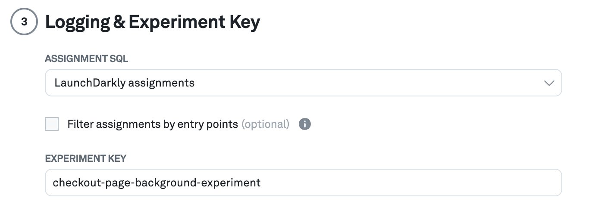
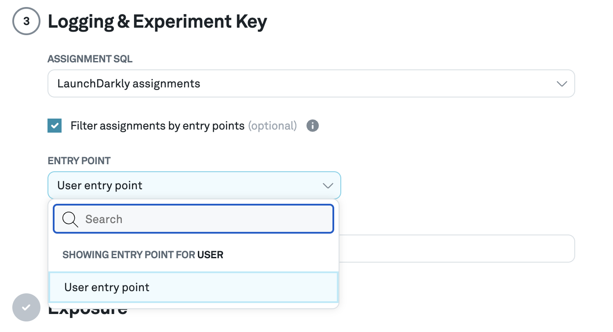

# Filtering assignments by entry point

For some experiments, subjects are assigned to a variant in one place, but are not exposed to it until they perform a certain action. For example, users may be assigned to all experiments upon visiting the homepage of a website, but only a subset of those users navigate to a page where an experiment is being conducted. More examples of when to consider using an entry point are available in this [guide](/guides/entry_points.md).

Eppo provides the ability to filter an assignment source by an [Entry Point](../../statistics/sample-size-calculator/setup#creating-entry-points) when configuring an experiment. This ensures that only the subjects assigned to that entry point are analyzed in the experiment, based on the logged events for that entry point.

## Entry point for an experiment

First you’ll need both an assignment source and an entry point source configured. Then, when setting up an experiment, check the box marked “Filter assignments by entry points” in the **Logging & Experiment Key** section:

…and select the desired entry point:

The filtering will take place during the next experiment calculation (either during the scheduled time or a manual update).

## Entry points for a sample size

Before you run a test, we recommend that you check how sensitive that experiment can be using our [Sample size calculator](../../statistics/sample-size-calculator/). Knowing how large an effect you can detect let you prioritise testing impactful, detectable changes. When the change will only be visible after the assignment, you can define an [Entry Point](../../statistics/sample-size-calculator/setup#creating-entry-points) to measure the sensitivity of the test more accurately.
