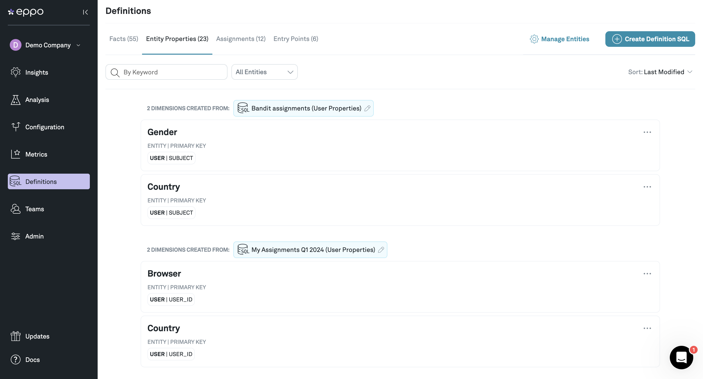
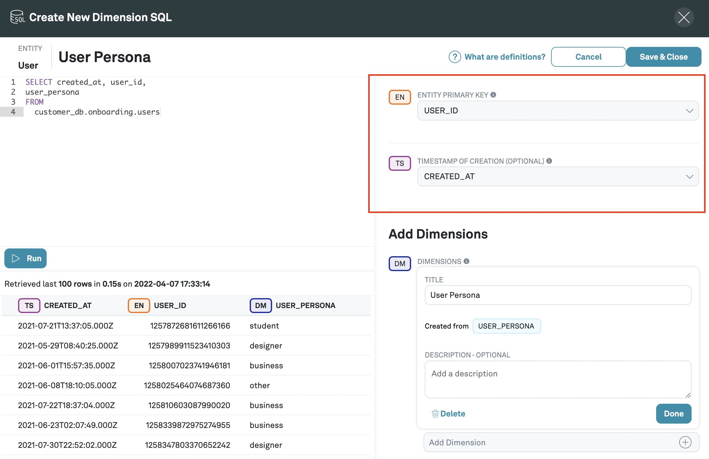
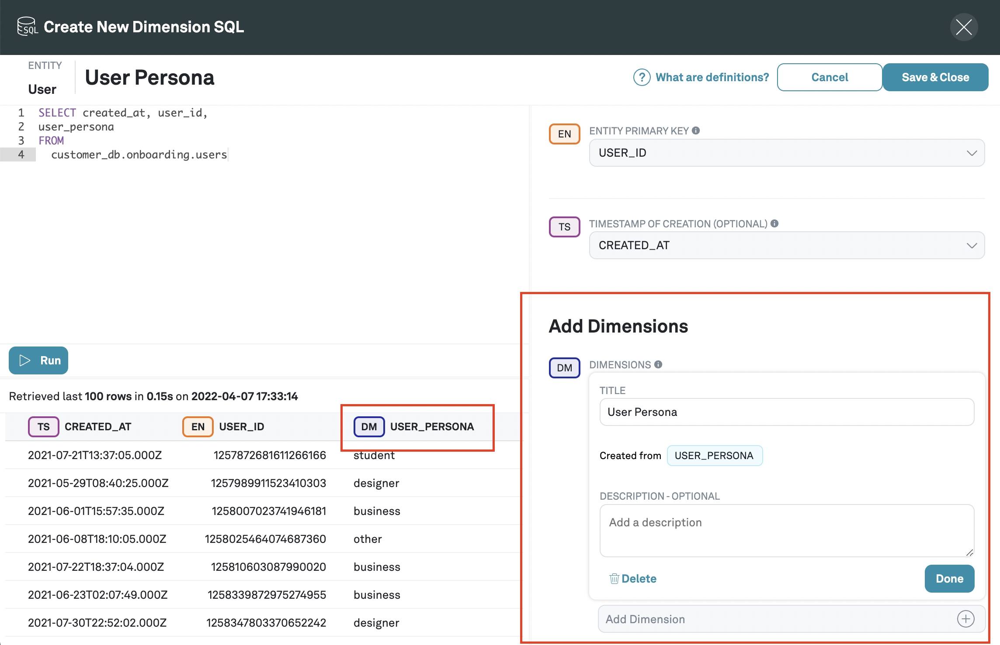

# Dimension SQL

When you write an **Assignment SQL**, you can optionally include any dimensions that you want to be able to slice/dice the analysis by.

```sql
SELECT
    ts_assigned,
    experiment_name,
    variant_name,
    user_id,
    browser,
    device_type
FROM mydb.myschema.assignments
```

In this example Assignment SQL, at the time of assignment, we logged the `browser` and `device_type` of the user. We included it in the Assignment SQL so that later on we can look at how metrics perform across different browsers and devices.

Dimensions can be any categorical data that lives in your data warehouse. Other potential examples include UTM parameters (source, medium, campaign), or geolocation.


## Create a Dimension SQL

If you include optional dimensions in your Assignment SQL, it will show up under **Definitions** > **Dimensions**



You can also create a dimension SQL separately:

1. Go to **Definitions** > **Create Definition** > **Dimension SQL**

2. Select the _Entity_ your _Dimension_ will be attached to

In this case we select *User*

3. Write SQL that fetches the dimensions you want for your user


4. Annotate the columns of the data that comes back



The required columns in order for Eppo to recognize the data are:

- Entity Id -- in this case, `USER_ID`
- Timestamp -- in this case, `CREATED_AT`

5. Add optional dimensions



Add any dimensions you would later like to slice by here; in the example above, we are adding the User Persona dimension.

5. Click **Save & Close**


