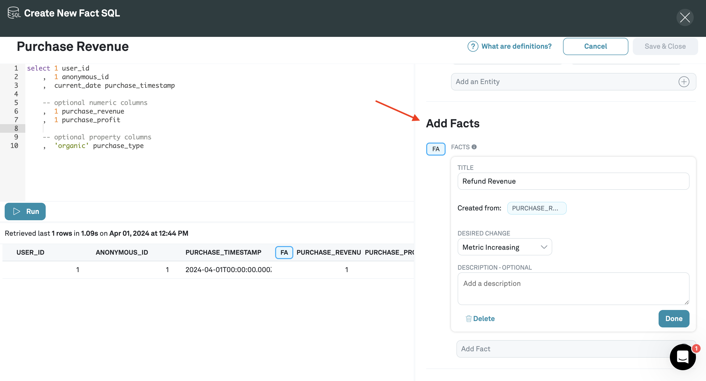

# Fact SQL

Fact SQL queries are queries that correspond to events.

When you write Fact SQL's, you're pulling data from the data warehouse that correspond to specific events that serve as input to metrics. For example, signups, activations, net subscriptions, etc.

## Creating a Fact SQL

1. Navigate to **Definitions** and click **Create Definition SQL**

2. Click **Fact SQL**

3. Select **User**

**User** is the default entity in Eppo but you can also create your own custom entity and select that here.

4. Name your Fact SQL

5. Write SQL in the SQL editor to pull events data from the data warehouse

Recall that that you should have (potentially multiple) event tables in your data warehouse with certain column types.

In this step, you're going to write SQL to pull that data.

6. Annotate the columns that you've selected from the data warehouse

In the example above, Eppo has already automatically determined that the `timestamp of creation` column is `TS` and the relevant `entity id` column is `USER_ID`.

8. Add Facts

Facts are the numeric quantities associated with the event. For every event that you want to track, you should add its corresponding column in the data warehouse as a fact.

In the example above, we would like to measure the effect of the experiment on revenue.

In the data warehouse, every time there is a revenue event (that might be someone purchasing something,), that event is logged as a row in the data warehouse.

This event is translated into an integer value, which is the revenue amount, that can then be used as an Eppo fact and tracked in an experiment.

10. Save & Close

You've now created your a Fact SQL. If you have more events that you would like to track in your experiment, you can repeat the steps in this section to create additional Fact SQLs.
