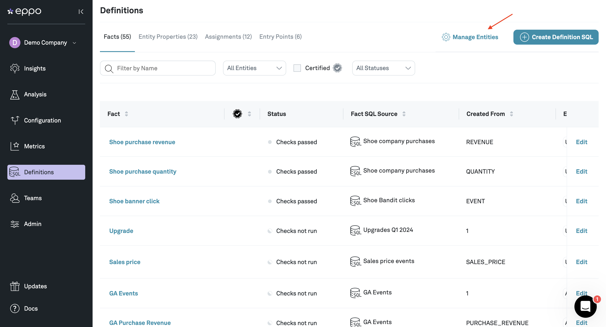

# Entities

Entities are the subjects (aka randomization unit) of your experiments. For example, if you are a food delivery app, and you want to run experiments on both Restaurants and Customers, you would have a restaurant entity and a customer entity. Eppo creates a user entity by default, but you can add additional entities or edit the name of user if necessary.

Assignment, Dimension, and Fact SQL's can be attached to entities -- for example, an assignment SQL attached to a user would pull the assignments of users into different experiment groups.

## Creating a custom Entity

To create a custom Entity, navigate to **Definitions** in the left menu bar from the Eppo homepage, then click **Manage Entities**.

A modal should pop up showing all the existing entities and their attached SQL's. Click **+ Create Entity** to create a new entity.

In the example above, we created a new entity called Company

Click **Confirm** and then **Save Changes**.
