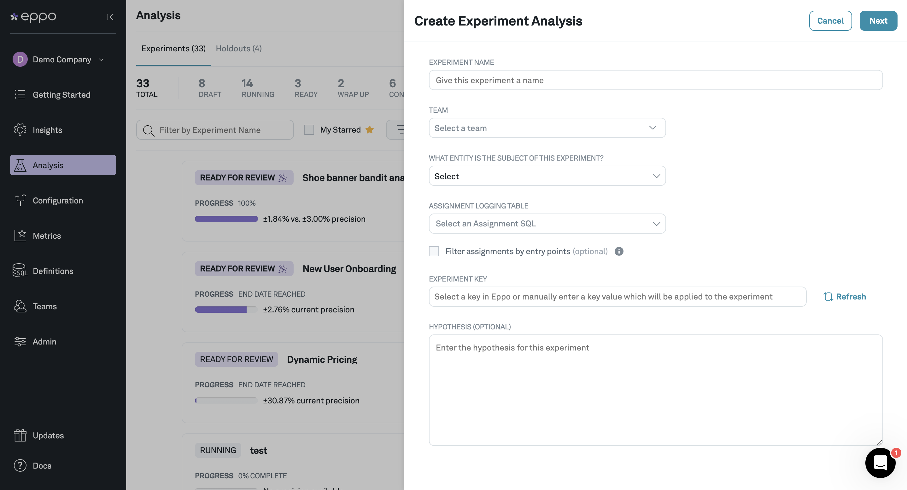
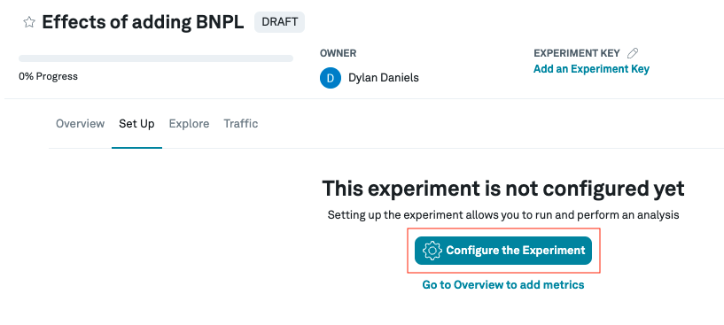
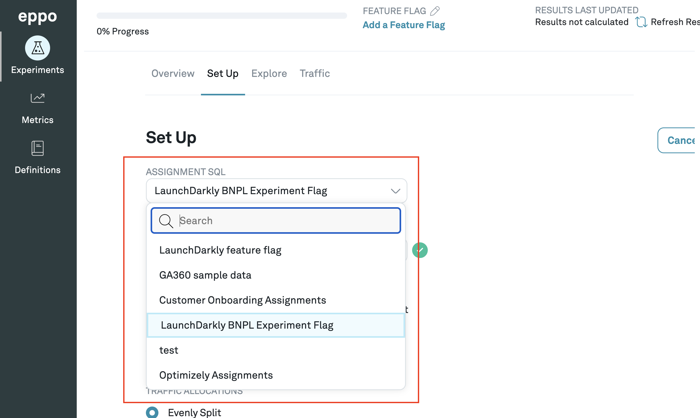

# Creating experiments

Experiments are a set of metrics that correspond to users being shown different feature sets that you would like to track over time.

### 1. Navigate to **Experiments** in the left-hand menu and click **+Experiment**

### 2. Fill out the **Create Experiment** Form

Give your experiment a name and hypothesis.

### 3. Click the **Configure the Experiment** button

### 4. Select the date range for your experiment.

You can also choose to set a metric event analysis period that is different from your assignment period. This is useful if you want to analyze the impact of an experiment on long-term metrics.

### 5. Select an assignment SQL from the definitions you created

If you are pre-assigning subjects before they are actually exposed to a variant, you may want to take advantage of the [*Filter assignments by entry points* checkbox](./filter-assignments-by-entry-point). This will include only those subjects that appear in an [entry point](../../planning-experiments/setting_up_the_sample_size_calculator#creating-entry-points) with an entry time after their assignment time.

### 6. Input feature flag name

When you created your assignment SQL, you should have made note of your feature flag name. In our case it's `new_user_onboarding`.

### 7. Input what percentage of traffic you want randomized into the experiment.

If you input 100%, 100% of the relevant entities (users in this case) will be included in the experiment.

### 8. Add the variants

When you created your assignment SQL, you should have made note of your variant names. In our case here it's `control` and `variant`.

You can go ahead and add each variant into the experiment here.

### 9. Select the traffic allocation you would like

The default is an even split between all the variants (including control), but you can also customize the allocation for unequal splits.

### 10. [Optional] The Statistical Analysis Plan {#analysis-plan-settings}
If you want to set custom statistical methodologies for this experiment, uncheck
the "use company default" checkbox next to the applicable fields. Otherwise, you
can stay opted in to using
the [defaults set by your company](../../../administration/setting-statistical-analysis-plan-defaults.md).
For information on the different analysis plan settings, see [Analysis plans](../../planning-experiments/analysis-plans.md).

11. Click **Save Changes**
