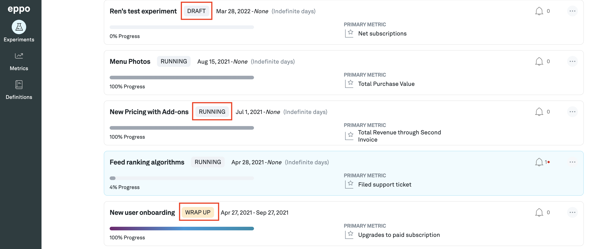

# Experiment status

You can navigate to the **Experiments** page by clicking on the **Experiments** icon from the left tab. Each experiment has an associated status which indicates the current state of the experiment. An experiment can have one of 4 different statuses:
1. Draft - The initial state after the experiment is created
3. Running - The active state where the experiment is assigning subjects and/or updating the metric event data
4. Wrap Up - The state where data is no longer updating, but a decision has not been made yet
5. Completed - The state where a decision regarding the experiment has been made

If you go on to the details page for an experiment and hover over the status tag, you can view more details about the status.

## Requirements to Move to the Next Experiment Status
| Status | Non-Eppo Randomized Experiment | Eppo Randomized Experiment |
| :--- | :--- | :--- |
| `DRAFT` | Go to `RUNNING` if… <li> Experiment key added </li>   <li> Active variation added </li> <li> Experiment started <em>(the assignment start date passed)</em> </li>| Go to `RUNNING` if…   <li> Experiment key added </li>   <li> Active variation added </li> <li> Experiment started <em>("Start Experiment" button pressed)</em> </li>|
| `RUNNING` | Go to `WRAP UP` if… <li> Experiment ended <em>(Larger of the end dates entered by the user has passed)</em> </li>   Go to `COMPLETED` if… <li> Decision made <em>(user clicks the “Make Decision” button and fills out the outcome and decision)</em> - This will update the end date if going from `RUNNING` to `COMPLETED` </li> | Go to `WRAP UP` if… <li>  Experiment ended <em>(User stops assignments & event analysis date has passed)</em> </li>   Go to `COMPLETED` if… <li> Decision made <em>(user clicks the “Make Decision” button and fills out the outcome and decision)</em> - This will stop assignments if still on and update the end date if going from `RUNNING` to `COMPLETED` </li>   Uncommon situation: If the event analysis end date is set to run longer than when assignments are stopped, clicking “Stop Assignment” will not change the experiment status from `RUNNING`. The experiment will remain in the `RUNNING` status until the larger of the two end dates have passed. Once that date has passed, the experiment will move into the `WRAP UP` status. |
| `WRAP UP` | Note: This step is skipped if user clicks “Make Decision” from the `RUNNING` state    Go to `COMPLETED` if… <li> Decision made <em>(user clicks the “Make Decision” button and fills out the outcome and decision)</em> - the dates are not affected </li> | Note: This step is skipped if user clicks “Make Decision” from the `RUNNING` state    Go to `COMPLETED` if… <li> Decision made <em>(user clicks the “Make Decision” button and fills out the outcome and decision)</em> - the dates are not affected </li> |
| `COMPLETED` | Go to `WRAP UP` if… <li> User reopens the experiment - this allows them to edit the date ranges and the decision made </li> | Go to `WRAP UP` if… <li> User reopens the experiment - this allows them to edit the event analysis date ranges and the decision made </li> |
