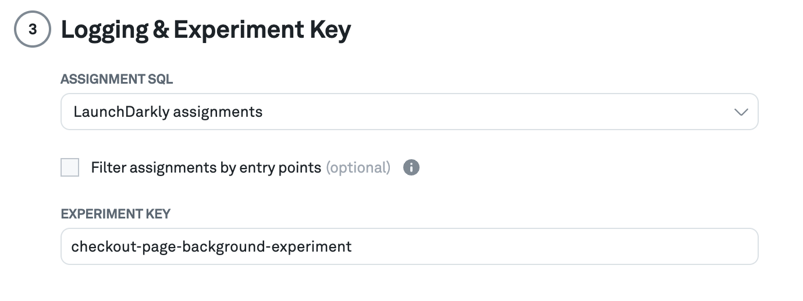
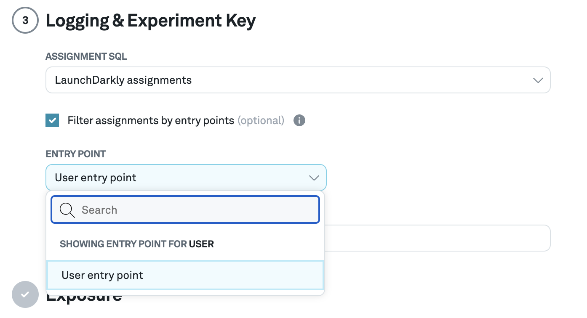

# Filtering assignments by entry point

For some experiments, subjects are assigned to a variant in one place, but are not exposed to it until they perform a certain action. For example, users may be assigned to all experiments upon visiting the homepage of a website, but only a subset of those users navigate to a page where an experiment is being conducted.

Eppo provides the ability to filter an assignment source by an [Entry Point](../../planning-experiments/setting_up_the_sample_size_calculator#creating-entry-points) when configuring an experiment. This ensures that only the subjects assigned to that entry point are analyzed in the experiment, based on the logged events for that entry point.

First you’ll need both an assignment source and an entry point source configured. Then, when setting up an experiment, check the box marked “Filter assignments by entry points” in the **Logging & Experiment Key** section:

…and select the desired entry point:

The filtering will take place during the next experiment calculation (either during the scheduled time or a manual update).
