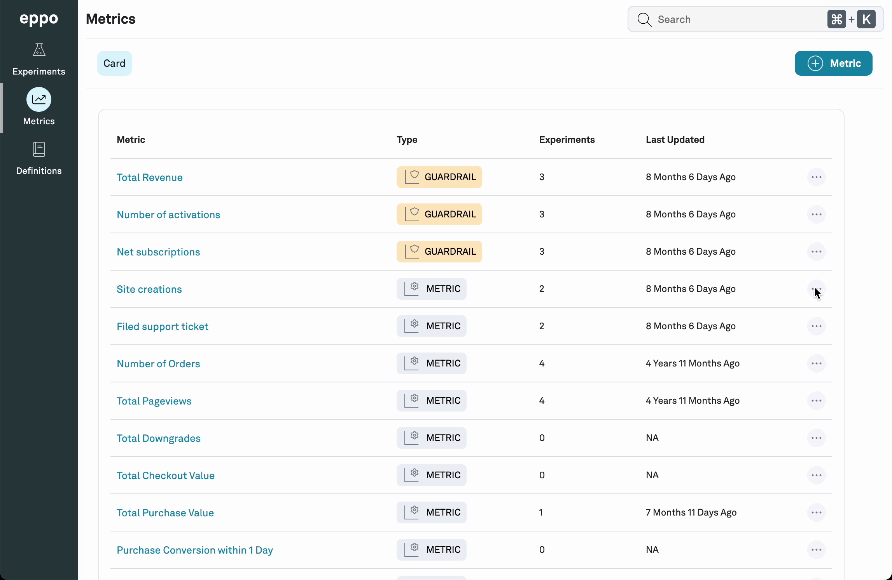

# Guardrail metrics

Guardrail metrics are metrics that will be included in every experiment.

They generally correspond to high-level business objectives that will always be important to measure in an experiment.

## Create Guardrail metrics

1. Navigate to **Metrics**

2. Click on the three dots on the right hand side of a metric

3. Select **Set as Guardrail metric** from the dropdown menu

