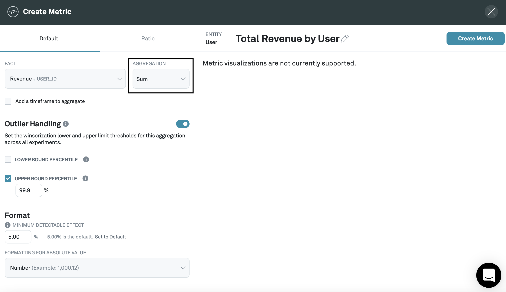

# Creating metrics

Metrics are statistics like "Revenue per User" or "Signup Rate" that Eppo will calculate for you. In order to create a metric, you first need to have set up a [Fact SQL Definition](/building-experiments/definitions/fact-sql) to point to the underlying data for your metric in your data warehouse.

1. Navigate to **Metrics**, click **+Metric**, then select **User** as the subject of the metric

**User** is the default entity in Eppo, but you can also create a [custom entity](../../building-experiments/entities) and select it here.

2. Select a fact

This should be one of the facts that you created in the step above, and should correspond to a metric that you want to track in an experiment.

3. Select an aggregation

The aggregation will aggregate over whatever the fact is measuring on a per-entity basis. So for example, if you select a `Revenue` fact and the `SUM` aggregation, the metric will be "average revenue per user;" if you select a `Name of Article Viewed` fact and the `COUNT DISTINCT` aggregation, the metric will be "Unique articles viewed per user."

Eppo supports the following aggregations:

- [SUM](#sum)
- [COUNT DISTINCT](#count-distinct)
- [COUNT](#count)
- [RETENTION](#retention)
- [CONVERSION](#conversion)

4. (Optional) Create a denominator for your metric

You may actually want to create a metric that is a ratio of two facts. To do this, click on the **Ratio** tab, and select the appropriate fact and aggregation for the denominator as well.

In the example above, we're creating a metric that corresponds to the revenue per user per purchase.

5. Select a minimum detectable effect

The minimum detectable effect refers to the smallest effect you want to reliably detect in experiments. The lower the minimum detectable effect you set, the more samples you'll need for the experiment to reach conclusive results.

## Metric aggregation types

### Sum

Sum computes metrics that are typically interpreted as averages per entity. If the fact value is NULL, it is discarded.

$\frac{\text{SUM of fact value}}{\text{Number of unique entities assigned}}$

Examples: average revenue per user, sign-up rate, minutes streamed per user, average order value.

### Count Distinct

Count Distinct computes the number of unique entities with a non-null event. If the fact value is NULL, it is discarded.

$\frac{\text{Number of unique entities with an event}}{\text{Number of unique entities assigned}}$

Examples: % of users with a video watch, % of visitors who viewed an article, % of users who entered checkout.

### Count

Count leverages SQL's ``COUNT`` to compute a total count of events per entity. If the fact value is NULL, it is discarded.

$\frac{\text{COUNT of fact values}}{\text{Number of unique entities assigned}}$

Examples: videos watched per user, articles viewed per visitor, orders per user.

### Retention

Retention metrics measure the proportion of entities who have at least one fact value appear after a fixed number of days (X) from experiment assignment. For example, a 7-day retention metric on the website visits fact might measure the proportion of users who visit a website at least 7 days after being assigned to the experiment.

$\frac{\text{Sum of \{1 if a non-null fact value is present X days after the assignment time, else 0, for each unique entity\}}}{\text{Number of unique entities assigned}}$

For example, if $X = 7 \text{ days}$, Eppo records a retention event for an entity when

$(\text{timestamp of event}) - (\text{timestamp of assignment}) >= 7 \text{ days}$.

### Conversion

Conversion metrics measure the proportion of entities who have at least one fact value appear within a fixed number of days (X) from experiment assignment. For example, a 7-day conversion metric might measure the proportion of users who sign up for a free trial within 7 days of being assigned to the experiment.

$\frac{\text{Sum of \{1 if fact value is non-null within X days of the assignment time, else 0, for each unique entity\}}}{\text{Number of unique entities assigned}}$

For example, if $X = 7 \text{ days}$, Eppo records a conversion event for an entity when

$(\text{timestamp of event}) - (\text{timestamp of assignment}) < 7 \text{ days}$.

