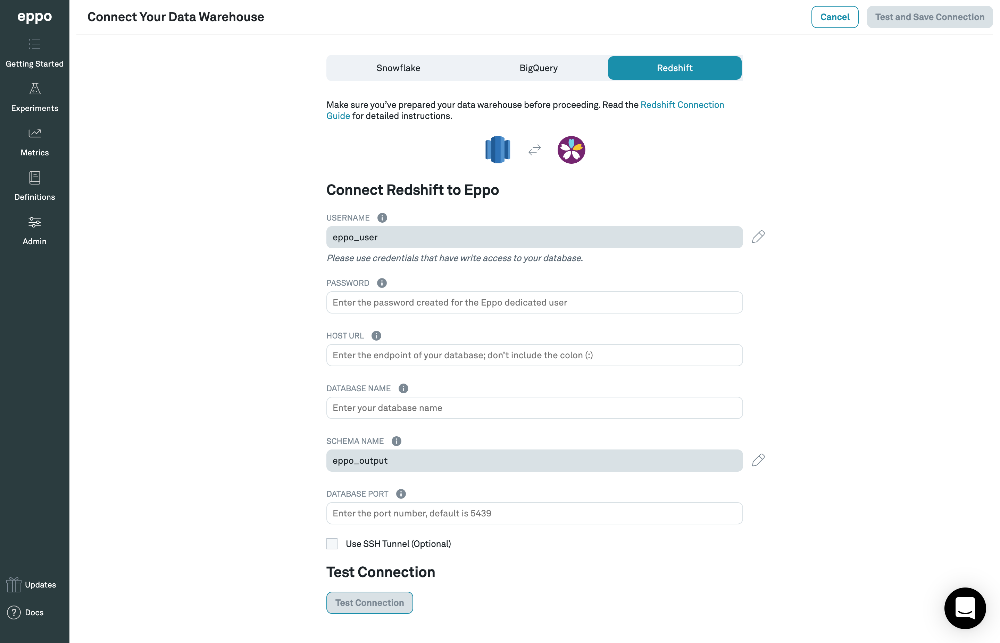

# Redshift

## Preparing your Warehouse for Eppo

Before you connect Eppo to your data warehouse, it is recommended that you create a User for Eppo. This User  should then be used to connect Eppo to your warehouse. Additionally, this User will need to be granted read access to tables from which you'd like Eppo to query SQL definitions from.

### 1. Add Eppo IP Address to Allowlist

For Eppo to connect to your Redshift database, you’ll need to allow our inbound IP addresses ( `35.226.89.62`, `34.133.196.109` ) in your Cluster’s Security Group settings:

1. Log in to the Redshift Management Console.
2. Select **Clusters** from the left sidebar then select the cluster you want to connect to Eppo.
3. From the Cluster Details page, navigate to the **Properties** tab and scroll to the **Network and Security** section.
4. Under VPC Security Groups, click the Security Group you want to use to allow communication from Eppo.
5. Click the **Inbound Rules** tab at the bottom of the page then click **Edit**.
6. Click **Add Rule** to add a new Inbound Rule.
    a. Set the Type to **Redshift**.
    b. Adjust the Port, if needed.
    c. Enter the following into the Source field: `35.226.89.62`, `34.133.196.109`
7. Click **Save**.

### 2. Create Dedicated User for Eppo

You should create a new user and grant SELECT permissions to the tables the user (i.e., Eppo) will access.

1. Go back to the Redshift console and connect the query editor to your data source.
2. Create a user with the query below, replacing `<password>` with a unique, secure password.

    _**Note**: The password must contain at least one uppercase, one lowercase, and one numeric character._

```sql
CREATE USER eppo_user WITH PASSWORD '<password>' SYSLOG ACCESS UNRESTRICTED;
```

3. Grant this user the appropriate privileges for any tables we will need to access. This
generally includes your assignment or exposure events, fact tables from which your
metrics are derived, and dimension tables that you commonly use in your analyses.

You can do so by running the following commands, replacing `<schema_name>` with the name of your schema.

```sql
GRANT USAGE ON SCHEMA <schema_name> TO eppo_user;`
`GRANT SELECT ON ALL TABLES IN SCHEMA <schema_name> TO eppo_user;
```

If you’d like to grant SELECT permissions on a table-by-table basis, you can run the query below to generate the queries to `GRANT SELECT ON` each table in a schema. You’ll then need to exclude any grant statements for tables that you don’t want the user to access.

```sql
GRANT SELECT ON TABLE <schema>.<table1> TO ROLE eppo_user;
GRANT SELECT ON TABLE <schema>.<table2> TO ROLE eppo_user;
```

_**NOTE**: The AWS Redshift query editor will not run multi-statement queries; it’s recommended you use SQL Workbench to connect to Redshift and run multiple queries at one time._

4. Create a schema for Eppo to write intermediate results and temporary tables.
```sql
CREATE SCHEMA IF NOT EXISTS eppo_output;
GRANT ALL ON SCHEMA eppo_output TO eppo_user;
```

### 3. Gather Redshift Connection Details

You'll want to gather the following connection details from Redshift:

- **Endpoint**: The endpoint of your Redshift cluster database

    Go to the **Properties** tab of your **Redshift Cluster Details** page.

    Under the **Connection details** section, copy the **Endpoint** up to but not including the colon (:).

- **Database Port**: default port number for Redshift is 5439

    From your **Redshift Cluster Details** page, you can find the port number under the **Database configurations** section of the **Properties** tab.

- **Database Name**: name of your Redshift database

    You can also find your **Database Name** under the **Database configurations** section of the Properties tab.

#### (Optional) SSH Tunnel

Eppo supports connecting to a Redshift cluster over an SSH tunnel.

Connect with a username & password combination or public key option.

**SSH tunnel with username and password**

* tunnel host
* username & password

**SSH tunnel with public key**

* tunnel host
* username
* public key

## Connecting your Warehouse to Eppo

Now that you have a proper User created for Eppo with adequate privileges, you can use it to connect Eppo to your warehouse.

### Initial Configuration of Credentials

1. Log in to your Eppo account at [eppo.cloud](https://eppo.cloud/)
2. Click the `Getting Started` button in the top-right corner. Once on that screen, and within the `Connect your Warehouse` tab, click the `Connect your data warehouse to Eppo` button in the bottom right-hand corner of the screen.
3. Once on the data warehouse connection screen, click the `Redshift` tab. From there, you should be prompted to enter all of the necessary information for doing so. This information includes:

- **Connection type** - Redshift
- **User** - `eppo_user`
- **Password** - the `<password>` you chose
- **Host Url** - **Endpoint** from [previous section](#gather-redshift-connection-details)
- **Database name** - **Database name** from [previous section](#gather-redshift-connection-details)
- **Schema name** - `eppo_output`
- **Port** - **Database port** from [previous section](#gather-redshift-connection-details)

4. Enter the values into the form (which should look like the screenshot below), then click `Test Connection`. Once this test succeeds, save your settings by clicking `Test and Save Connection`.



**Note**: Eppo uses [Google Secret Manager](https://cloud.google.com/secret-manager) to store and manage your credentials. Credentials are never stored in plaintext, and Secret Manager can only be accessed via authorized roles in GCP, where all usage is monitored and logged.

### Updating Credentials

Credentials can be updated at any time within the Admin panel of the app.
