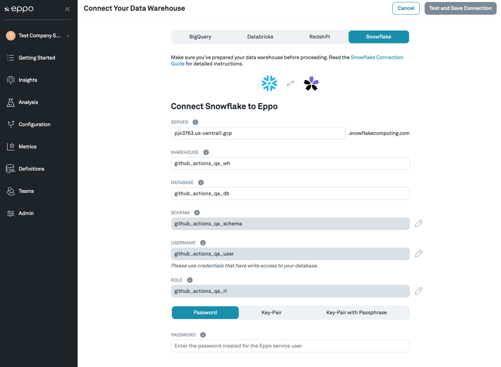

# Snowflake

## Preparing your Warehouse for Eppo

Before you connect Eppo to your data warehouse, it is recommended that you create a service User for Eppo. This service User should then be used to connect Eppo to your warehouse.

Additionally, you will need to create a schema for Eppo to write intermediary tables to, as well as grant the service User read access to tables you'd like Eppo to query SQL definitions from.

### 1. Create a Service User for Eppo
1. Log into Snowflake with a user that has `ACCOUNTADMIN` privileges.
2. Create a user with the following command, replacing `<password>` with a unique, secure password:

```sql
USE ROLE ACCOUNTADMIN;
CREATE ROLE IF NOT EXISTS eppo_role;
CREATE USER IF NOT EXISTS eppo_user
PASSWORD = ‘<password>’;
GRANT ROLE eppo_role TO USER eppo_user;
ALTER USER eppo_user
SET DEFAULT_ROLE = eppo_role;
```

3. Grant this user the appropriate privileges for any tables we will need to access. This
generally includes your assignment or exposure events, fact tables from which your
metrics are derived, and dimension tables that you commonly use in your analyses.
```sql
GRANT USAGE ON DATABASE <database> TO ROLE eppo_role;
GRANT USAGE ON SCHEMA <schema> TO ROLE eppo_role;
GRANT SELECT ON TABLE <schema>.<table1> TO ROLE eppo_role;
GRANT SELECT ON TABLE <schema>.<table2> TO ROLE eppo_role;
...
GRANT SELECT ON TABLE <schema>.<tableN> TO ROLE eppo_role;
```

### 2. Create Schema for Eppo to Write Results to

1. Create a schema for Eppo to write intermediate results and temporary tables.
```sql
CREATE SCHEMA IF NOT EXISTS eppo_output;
GRANT ALL ON SCHEMA eppo_output TO ROLE eppo_role;
```

2. (Optional) Create a warehouse for Eppo to use
```sql
CREATE WAREHOUSE IF NOT EXISTS eppo_wh
WAREHOUSE_SIZE = <wh_size>
AUTO_SUSPEND = 300
INITIALLY_SUSPENDED = true;
GRANT ALL PRIVILEGES ON WAREHOUSE eppo_wh TO ROLE eppo_role;
```

3. (Optional) Add Eppo’s static IP addresses to your [Network Policy](https://docs.snowflake.com/en/user-guide/network-policies.html) if you have one:
`35.226.89.62`, `34.133.196.109`

## Connecting your Warehouse to Eppo

Now that you have a proper Service User created for Eppo, you can use it to connect Eppo to your warehouse.

### Initial Configuration of Credentials

1. Log in to your Eppo account at [eppo.cloud](https://eppo.cloud/)
2. Click the `Getting Started` button in the top-right corner. Once on that screen, and within the `Connect your Warehouse` tab, click the `Connect your data warehouse to Eppo` button in the bottom right-hand corner of the screen.
3. Once on the data warehouse connection screen, click the `Snowflake` tab. From there, you should be prompted to enter all of the necessary information for doing so. This information includes:

- **Server** - everything before the `.snowflakecomputing.com` in the customer's snowflake URL. For example, if your Snowflake account URL is `my-company.us-east-1.snowflakecomputing.com` then the value to enter is `my-company.us-east-1`.
- **Warehouse** - from inside your Snowflake instance, click the **Warehouses** item from the menu -- choose from among the listed warehouses
- **Database** - **Database name** from step 3 in the previous section
- **Schema** - `eppo_output`
- **Username** - `eppo_user`
- **Password** - the `<password>` you chose

4. Enter the values into the form (which should look like the screenshot below), then click `Test Connection`. Once this test succeeds, save your settings by clicking `Test and Save Connection`.



**Note**: Eppo uses [Google Secret Manager](https://cloud.google.com/secret-manager) to store and manage your credentials. Credentials are never stored in plaintext, and Secret Manager can only be accessed via authorized roles in GCP, where all usage is monitored and logged.

### Updating Credentials

Credentials can be updated at any time within the Admin panel of the app.
