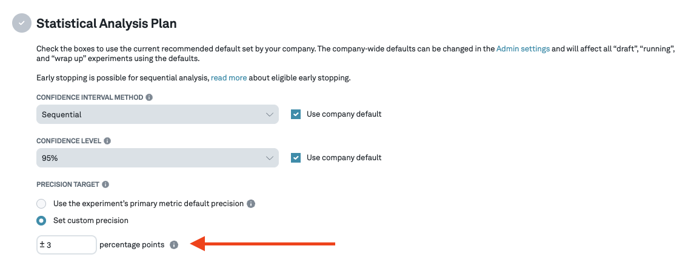
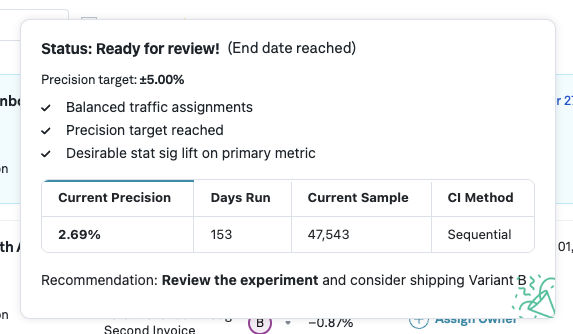
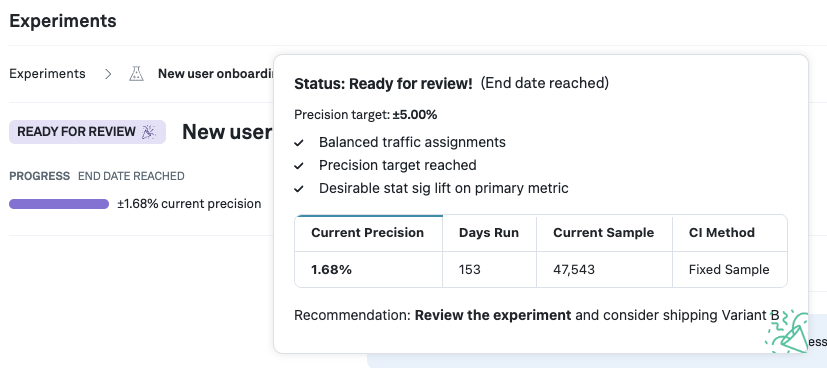

# Experiment Progress Bar

The progress bar helps us understand how much data we have gathered and whether we can confidently end the experiment and make a decision.

## Precision {#precision}

The progress of an experiment is measured with respect to **precision**. Precision is the uncertainty in the point estimate as defined by the width of the confidence interval.

:::tip Precision example

For example, suppose that a metric shows a 5% lift for treatment variant versus the control variant, with a confidence interval of 3% to 7%. Then, the precision is 2%.

:::

Precision is set at the metric level. However, it is possible to override this and set it to a particular value at the experiment level.

**Note:** A smaller precision requires the experiment to run much longer to collect sufficient data.

## Progress Bar

The goal of the progress bar is to measure whether we have gathered enough data to be confident in making a decision.

To view the progress bar, we must first navigate to the **Experiments** tab from the left panel. The progress bar can be seen in the list item card for each experiment in the experiment list. It can also be seen in the right panel if we click the card. Hovering over the progress bar shows we more details like the % lift that can be detected with the assignments seen so far:

we can also see the progress bar on the details page for each experiment:

Furthermore, when hovering over a progress bar, additional information about the current progress of the experiment is shown:

**Note:** We compute the days remaining using a linear interpolation. This interpolation does not take into account that gathering data usually slows down during an experiment, and so the estimate may be optimistic, especially in the early days of an experiment.

## How to use the progress bar

Traditionally, when using a fixed sample test, we decide up front how long the experiment ought to run and cannot interpret results until we have finished gathering all data. However, the sequential testing approach we use allows for flexibility in deciding when to stop an experiment. Here's some advice on how to get the most out of the progress bar.

Before starting with any experiment, we have to set the precision to something that makes sense for our use case. Two aspects are important:

- What constitutes a meaningful impact to the business: a 0.1% increase in revenue can be valuable for a company that operates at the scale of Google, but for a start-up that looks to grow 3x year over year, this would make for a negligible impact.
- What effect sizes are we able to detect in a reasonable amount of time given the data volume. It's important to keep in mind that, as a rule of thumb, detecting an effect twice as small takes 4 times as long. Thus if based on our data volume it takes a month to detect a 10% lift, then it would take 4 months to detect a 5% lift. A constraint on the maximum time we are comfortable running an experiment often limits what MDE we can aim for.

Suppose, given the above considerations, we decide to set our precision at 5%. We start our experiment, the progress bar begins to fill up. How should we use it to make decisions?

### Frequentist fixed sample methodology

When using the frequentist fixed sample methodology, the experiment runtime has to be decided ahead of time, e.g. using a sample size calculator, or prior experience from similar experiments.
Once the end date of the experiment is reached, or the precision target is met for all primary metrics of the variants, the progress bar is at 100% and we marke the experiment **ready for review**.
You are now able to confidently make a decision:

### Sequential and Bayesian methodology

When using either the sequential confidence intervals, or Bayesian methodology, the above still applies.
But with both of these there is another option: both of these methods[^1] are always-valid and hence you can confidently stop an experiment any time.

Whenever we detect that a primary metric of one of the variants is statistically significant (the confidence/credible interval does not contain 0%), we mark the experiment is **early stopping eligible\*** and hence **ready for review**. Of course, you might still want to run the experiment for longer, e.g. to obtain more data on secondary metrics. In the following example, the precision target is set to 2%, which has not been reached yet, but the experiment is still eligible for early stopping as we see a statistically significant lift and are using sequential analysis:

<!-- todo: uncomment when we roll out minimum requirements
## Minimum requirements

It is important to keep in mind that the results we show are based on the period the data was collected. It is not uncommon to see strong weekly effects (users behave differently on Monday morning versuse Friday night), or novelty effects.
Therefore, it is often useful to set minimum requirements, e.g. an experiment should run for at least 7 days.
We also allow setting a maximum experiment runtime, which helps ensure experiments are not accidentally left stuck in the running state.

Furthermore, our statistical methods rely on having sufficient number of observations to be valid; the amount of data collected in a usual experiment is often much larger than the minumum number of samples required, so this is likely not a concern, but we do allow setting minimum sample size requirements as well.
 -->

## Mathematical details of computing progress

To compute progress, we first compute the **current precision**, which is simply the width of the confidence interval.
We then define progress as $\text{Progress} = \left(\frac{\text{Target precision}}{\text{Current precision}}\right)^2$. The square comes from the fact that if we want to detect an effect twice as small, we need roughly 4 times more data.

:::tip Progress example

Suppose the target precision on an experiment is 5%, and we have a single treatment variant whose primary metric has a point estimate of 0%, with confidence interval of (-10%, 10%). In this case, our current precision is 10%.
Hence, the current progress is $\left(\frac{5\%}{10\%}\right)^2$ = 25%.
Note the quadratic relationship between precision and progress: if we want to reduce the precision by a factor of 2, we need to gather 4 times as much data: this is a fundamental law that shows up all over statistics.

:::

[^1]: Note: for the Bayesian methodology this relies on the fact that the prior is set accurately. E.g. when using an uninformative prior, one should not use early stopping.
