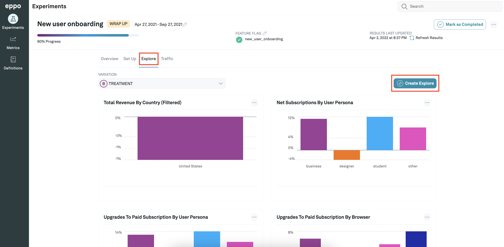
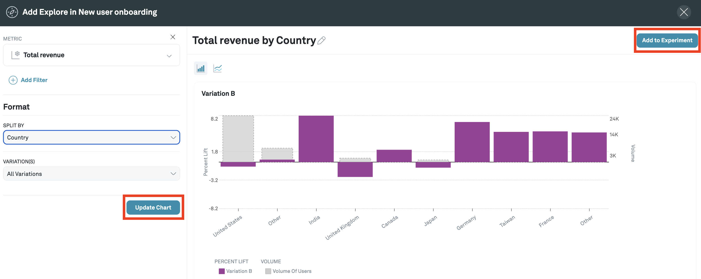

# Exploring Metrics
You can dive deeper into the results of your experiments by creating graphs with the result data. To do this, first navigate to the **Experiments** page using the tab on the left panel and click on the experiment you are interested in. Then, click on the **Explore** tab.

You can create a new chart by clicking on the **Create Explore** button.

On the page to create a new Explore chart, you first need to select a metric for consideration. You can also add filters and a split-by to the chart and select the variation you are interested in. Click the **Update Chart** button to view the chart built with your selected criteria. Finally, you can click the **Add to Experiment** button to add it to the **Explore** tab of the experiment.

