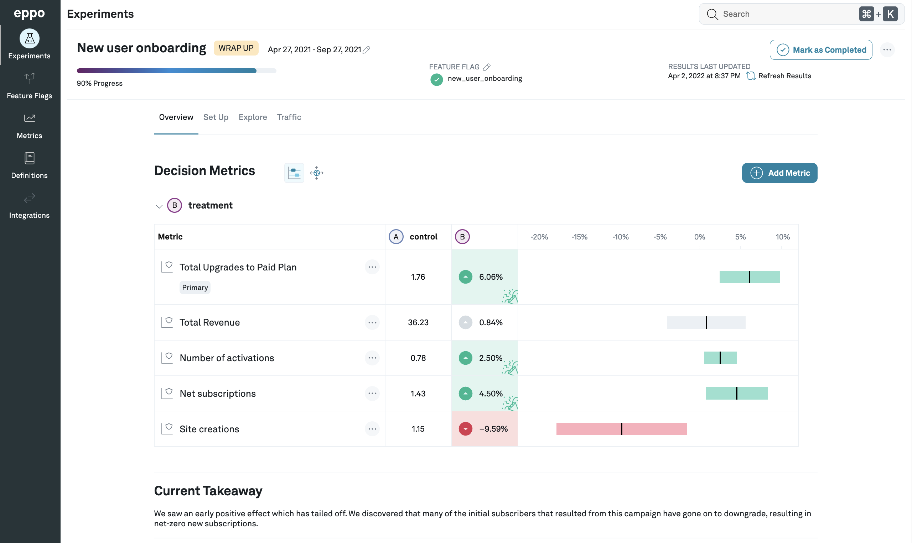
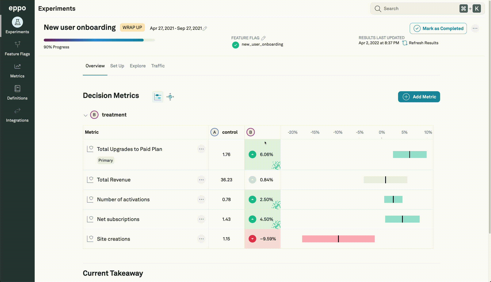
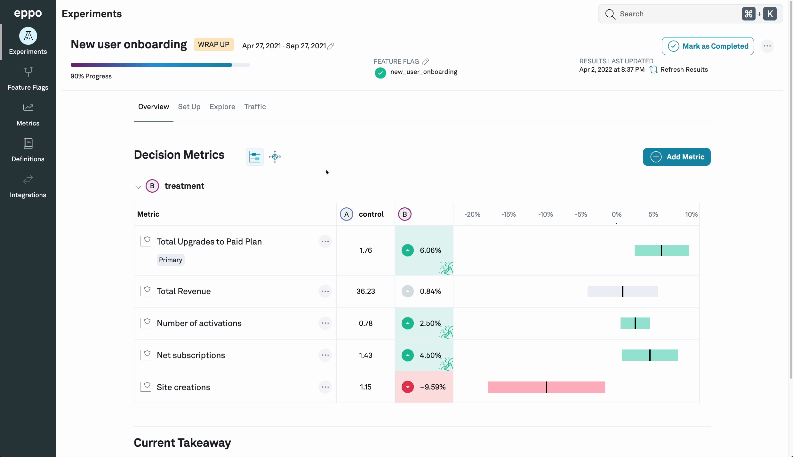

# Interpreting experiments

To see how things are going with your experiment, you will typically start at the **Overview** tab of the **Experiments** pane.

This tab gives you an overview of the different metrics that [you have attached to the experiment](../building-experiments/experiments/adding-metrics-to-experiment.md) and how they have been affected by the different variants.

Each variant is compared to the control.

In the example above, we see that the control value of **Total upgrades to paid plan** is 1.76% while the treatment value of variant B is 6.06%. This is marked in green because we have previously designated that an increase in the metric is good.

For more details about the metric, you can hover over the control or treatment value. A popover will appear that also presents the raw control and treatment values, as well as the traffic population sizes.

There are two icons next to the **Decision metrics** heading. By default, the **Confidence internal** icon will be selected, and the rightmost columns of the metrics results table will present [confidence intervals](./confidence-intervals.md).

If you select the **Impact accounting** icon to the right, however, the rightmost colums of the metrics results table will instead present the [Global lift](./global-lift.md) of the particular metric.

## Segments and filters

You are able to filter experiment results to specific subgroups by selecting the filter menu at the top right corner. We provide two distinct options to filter results

### Segments

Segments are pre-specified subsets of users based on multiple attributes. For example, you might have a "North America mobile users", created by filtering for Country = 'Canada', 'USA', or 'Mexico', and Device = 'Mobile'. You can then attach such a segment to any experiment and Eppo pre-computes experiment results for such a subgroup.

Note that when you first add a segment to an experiment, you have to manually refresh the results to compute the results for the segment.

### Single dimension filter

For quick investigations, we also provide the single dimension filter: here you can select a single dimension (e.g. Country) and single value (e.g. 'USA'). These results are available immediately -- no need to manually refresh the results.

## Explores

You can also further investigate the performance of an individual metric by clicking on navigator icon the next to the metric name. This will take you to the [Metric explore](./exploring-metrics.md) page where you can further slice the experiment results by different dimensions that have been configured, for example user persona, or browser, etc.

