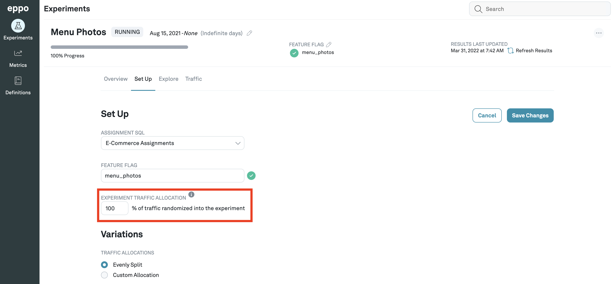
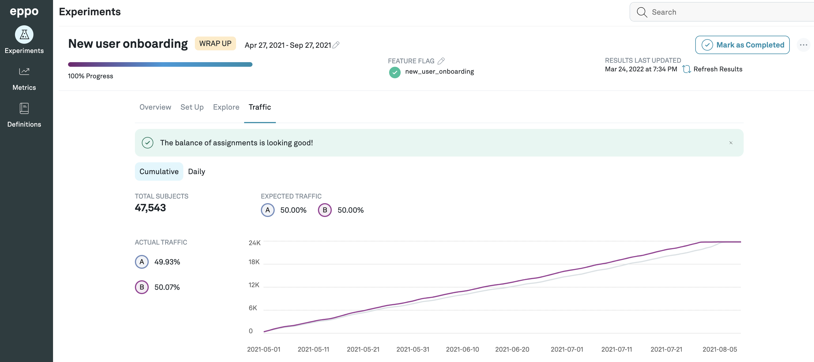
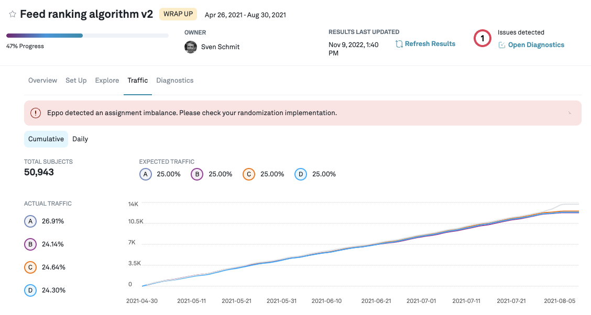

# Traffic and Traffic Imbalances

Navigate to the **Experiments** page by clicking on the **Experiments** icon from the left tab and then from the list, click on the experiment that you are interested in.
The details page for each experiment contains a **Set Up** tab where you can configure the % of traffic you want to randomize into the experiment.

The **Traffic** tab shows you a comparison of the traffic seen between the variants being considered for the experiment.
You can also toggle between seeing the cumulative, or daily traffic.

The traffic tab runs a test to see whether the randomization works as expected and the number of subjects assigned to each variation is as expected.
When assignments are not balanced you will see a warning next to the tab and above the graph.
This indicates that there is likely an issue with the randomization of subjects (e.g. a bug in the randomization code),
which can invalidate the results of an experiment.

We run this traffic imbalance test by running a [Pearson’s chi-squared test](https://en.wikipedia.org/wiki/Pearson%27s_chi-squared_test) with $\alpha=0.001$ on active variations,
using the assignment weights for each variant (default is equal split across variations), which we convert to probabilities.
This is also known as the sample ratio mismatch test (SRM).
We run the test at the more conservative $\alpha=0.001$ level because this test is not sequentially valid;
the more conservative significance level helps us avoid false positives.
