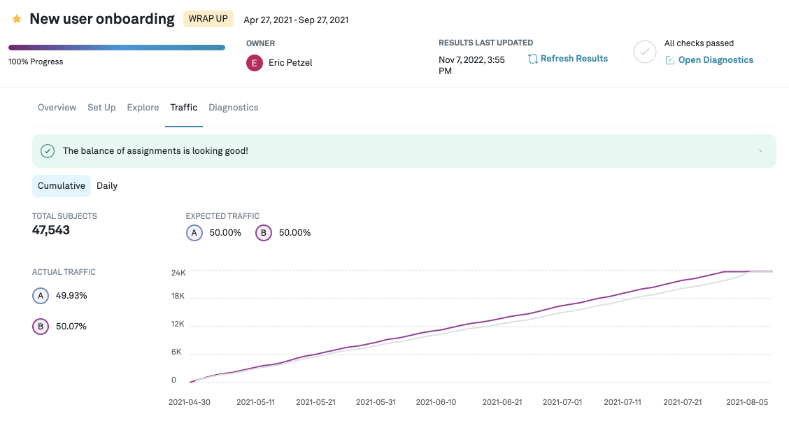
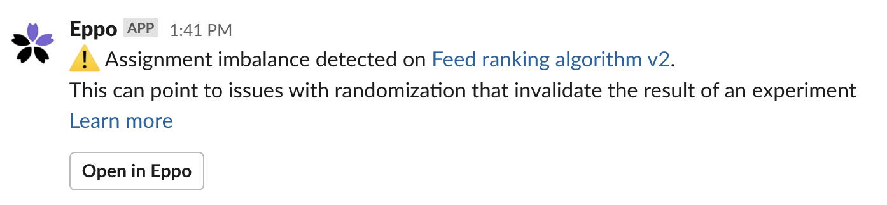

# Traffic and Traffic Imbalances

Validity of experimental results crucially relies on proper randomization of subjects.
The traffic tab shows how many subjects are randomized into the experiment, and how they are divided across variants.
Furthermore, we use the sample ratio mismatch test to verify that subjects are divided across variants as expected.

## Traffic diagnostics

To check traffic diagnoistics, navigate to the **Experiments** page by clicking on the **Experiments** icon from the left tab and then from the list, click on the experiment that you are interested in.
The details page for each experiment contains a **Set Up** tab where you can configure the % of traffic you want to randomize into the experiment.

The **Traffic** tab shows you a comparison of the traffic seen between the variants being considered for the experiment.
You can also toggle between seeing the cumulative, or daily traffic.

The traffic tab runs a test to see whether the randomization works as expected and the number of subjects assigned to each variation is as expected.
When assignments are not balanced you will see a warning next to the tab and above the graph.
This indicates that there is likely an issue with the randomization of subjects (e.g. a bug in the randomization code),
which can invalidate the results of an experiment.

We run this traffic imbalance test by running a [Pearson’s chi-squared test](https://en.wikipedia.org/wiki/Pearson%27s_chi-squared_test) with $\alpha=0.001$ on active variations,
using the assignment weights for each variant (default is equal split across variations), which we convert to probabilities.
This is also known as the sample ratio mismatch test (SRM).
We run the test at the more conservative $\alpha=0.001$ level because this test is not sequentially valid;
the more conservative significance level helps us avoid false positives.

## Traffic alerts

When we detect a mismatch between expected traffic allocation and observed allocations in the data, Eppo surfaces a traffic alert both on the Traffic page, as well as the diagnostics page.
Optionally, we also send a Slack notification.

While it is not always easy to understand down what caused the alert, it is important to track it down and understand its source.
Traffic imbalance often indicates that the results of an experiment cannot be trusted.

Issues with the traffic allocations can come from many sources; here are some common ones we have seen:

- There is an issue with the logging assignments (note this could be introduced through latency)
- Traffic allocations are updated in the middle of an experiments; in general, try to avoid changing the traffic allocations during an experiment
- Assignments for one variant (e.g. the control cell) started before assignments to other variants

