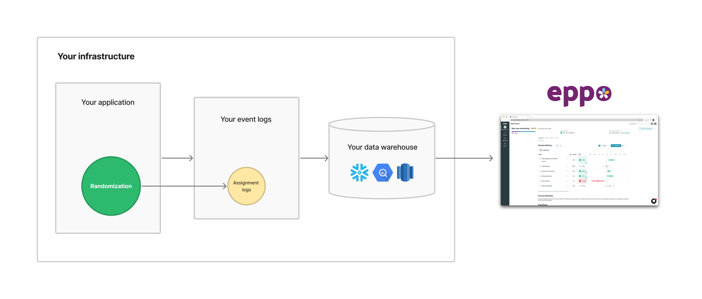

# Prerequisites

To analyze experiments on Eppo you must first:

1. Set up a function to assign subjects to experiments in your application and log those assignments into your application's event stream.
2. Direct your application's event stream into your data warehouse, commonly achieved using a tool like Segment.
3. Connect Eppo to your data warehouse by setting up a dedicated service account.

In order to perform its analyses, Eppo needs access to an assignment table in your data warehouse that lists each user that comes through the system and which variant they saw at which time.

| timestamp | user_id | experiment | variation |
| --------- | ------- | ---------- | --------- |
| 2021-06-22T17:35:12.000Z | 165740867980881574 | adding_BNPL_experiment | affirm |

If your infastructure lines up with this diagram and you already have data in this format, you can skip right to [connecting your data warehouse](./connecting-to-data-warehouse/). If you are new to experimentation or are interested in hearing our recommended best practices, read further into our guides on [experiment assignment](./experiment-assignment/) and [event logging](./event-logging/).

