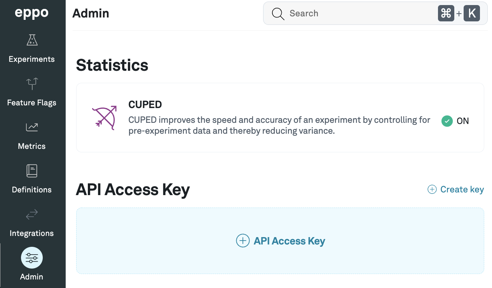
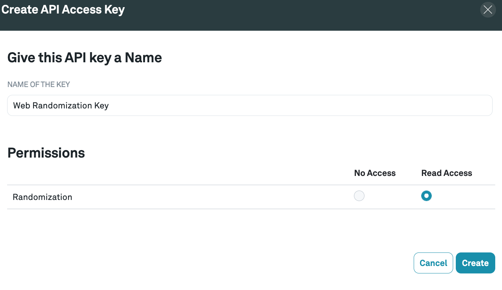
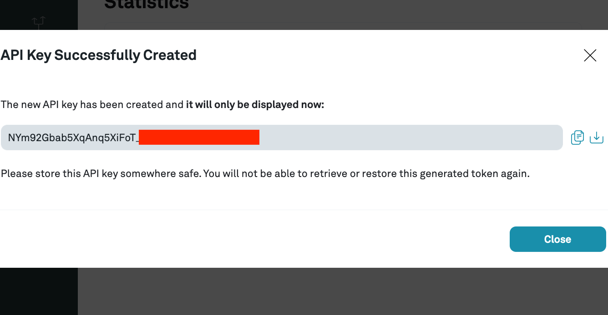

import Tabs from '@theme/Tabs';
import TabItem from '@theme/TabItem';

# Create assignment table with Eppo Randomization SDK

# Overview

You can use Eppo’s SDK to randomly assign subjects to your Eppo experiment variations. Given a  subject and experiment, the SDK assigns a variation based on your experiment traffic allocation and variations configured in Eppo. If the traffic allocation changes, subjects already assigned to a variation are not reassigned.

# Getting Started

## Generating an API Token

You will need to generate an API token that allows your application to communicate with Eppo’s experiments API. Do not share your API token with anyone outside your organization.

### 1. Navigate to the **Admin** tab in the Eppo homepage and click **Create Key**


### 2. Fill in a unique name for the key and give it read access


### 3. Click **Create**

A modal will pop up with the API key -- download it or copy it somewhere else for safe-keeping.


### 4. Close your modal to see your API token


## Install the SDK package in your preferred language

:::note
Eppo’s Node SDK is meant for use in server applications only. It is not compatible with browser or client JS applications.
:::

<Tabs>
<TabItem value="node" label="Node">

```bash
yarn add @eppo/node-server-sdk
```

</TabItem>
<TabItem value="python" label="Python">

```bash
pip install eppo-server-sdk
```
</TabItem>
</Tabs>


## Initializing the Eppo Client in your application code

Initialize the SDK once when your application starts up to generate a shared client instance. Upon initialization, the SDK will begin polling Eppo’s API at regular intervals to retrieve your experiment configurations.

:::note
The client must be a singleton. The client instance stores assignment configurations in memory. The same client instance should be reused for the lifetime of your application. Do not generate a new instance on every request.
:::

<Tabs>
<TabItem value="node" label="Node">

```ts
import * as EppoSdk from '@eppo/node-server-sdk';

const eppoClient = await EppoSdk.init({ apiKey: 'YOUR_API_KEY' });
```

</TabItem>
<TabItem value="python" label="Python">

```python
import eppo_client
from eppo_client.config import Config

client_config = Config(api_key="<YOUR_API_KEY>")
client = eppo_client.init(client_config)
```

</TabItem>
</Tabs>


## Retrieving Assignment Configurations

Each SDK client exposes a variation assignment function. This function takes 2 inputs:

- `experimentKey` - this is the value from the “Feature Flag” input on the Experiment “Setup” tab as seen in the below screenshots
- `subjectKey` - the entity ID that is being experimented on, typically represented by a uuid.


For the SDK to assign an experiment variation to a subject, the experiment must have a non-zero **Experiment Traffic Allocation**.

If the experiment has zero experiment traffic allocation, you may still initialize the SDK in your application, but the variation assignment function will return `null` if the `subject` input does not belong to the experiment sample population. For example, if the traffic allocation is 25%, the assignment function will return a variation for 25% of subjects and `null` for the remaining 75%.

See the below language-specific examples for how to invoke the assignment function:

<Tabs>
<TabItem value="node" label="Node">


```ts
import * as EppoSdk from '@eppo/node-server-sdk';

const client = EppoSdk.getInstance();
const variation = client.getAssignment("user-1", "my-experiment")
```

</TabItem>
<TabItem value="python" label="Python">

```python
import eppo_client

client = eppo_client.get_instance()
variation = client.get_assignment("user-1", "my-experiment")
```

</TabItem>
</Tabs>


