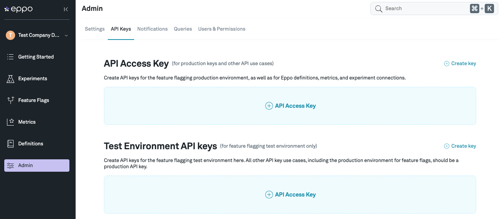
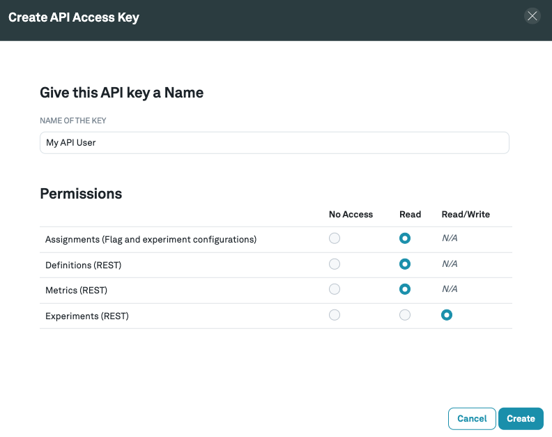

# API Keys

You will need to initialize whichever SDK you choose with an API key. The SDK uses this key to authenticate requests to Eppo's API for retrieving your experiment variations. Do not share your API token with anyone outside your organization.

### Navigate to **API keys** section of the **Admin** tab

### API Key Permissions

Make sure to give your API Key read access to the Eppo's randomization settings. This permission allows the SDK to retrieve information about your experiment variations, traffic allocations, and allow-list overrides.

