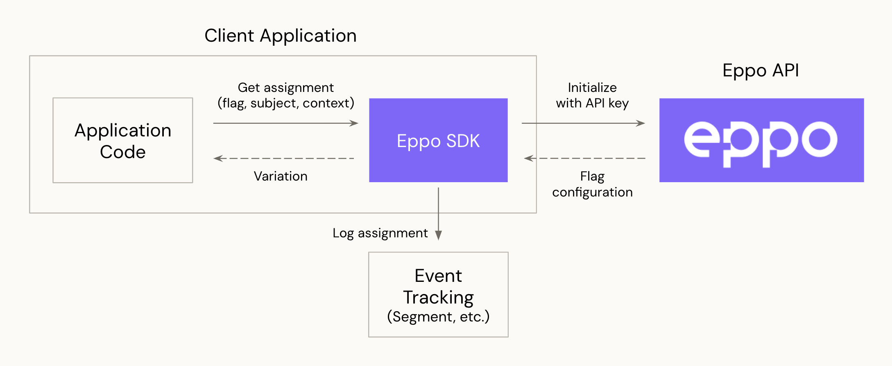
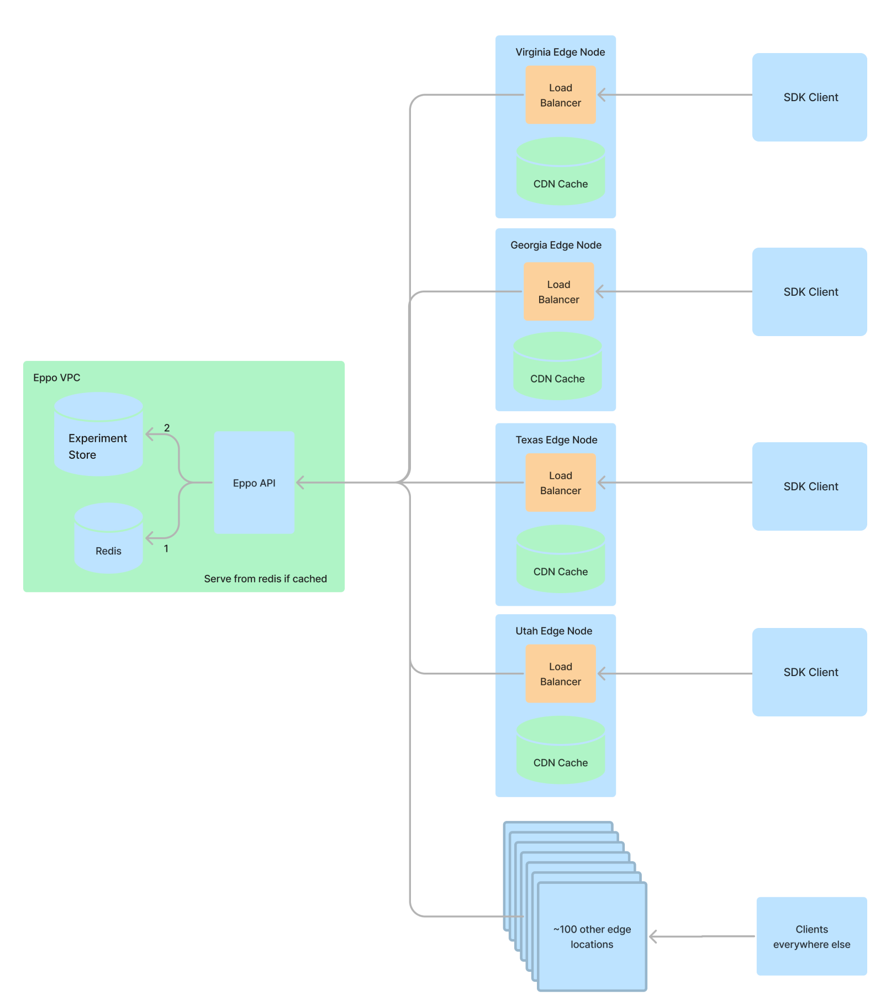

# Client SDKs

Eppo's client SDK integrates with client-side applications that run on a user device. The below diagram shows how the SDK interacts with your application code, event tracking system, and Eppo's servers:

1. **Initialization**: The SDK retrieves experiment configurations from Eppo using an API key provided during initialization. The configuration data includes experiment variations and traffic allocation. The SDK stores these configurations locally on the device for quick lookup during assignment.

2. **Assignment**: Once the SDK is initialized, your application code invokes the SDK to assign a variation to an experiment subject. This step does not involve any network request.

3. **Logging**: The SDK logs assignment events to whichever event tracking system you use (for example [Segment](https://segment.com/docs/)) using a callback function you provide on SDK initialization. The assignment data includes information about the assigned variation and subject.

### Globally Distributed Experiment Configurations

The SDK retrieves experiment data from a CDN that is globally distributed to over 100 edge locations. Each CDN location maintains a cache experiment data. 90% of requests are served by the CDN cache, while the remaining are handled by Eppo’s servers in the us-central GCP region. If there is a change to an experiment, such as an increase in traffic allocation, cached experiment configurations are updated within 10 minutes.

The SDK uses a background process to fetch and store the experiment data. The p75 latency of these requests is 50ms. This latency does not affect variation assignments, which use locally stored experiment data.

### Language-specific Documentation
- [JavaScript](./javascript.md)