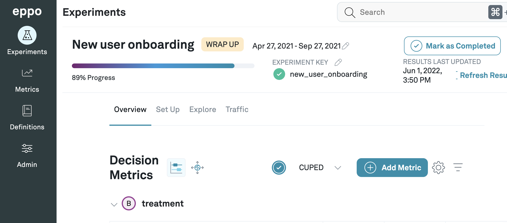

import Tabs from '@theme/Tabs';
import TabItem from '@theme/TabItem';

# JavaScript

:::note
This documentation is for our client-side SDK intended for use by browser applications. For use in server applications, refer to our [Node JS SDK](../server-sdks/node.md).
:::

### 1. Install the SDK
You can install the SDK with Yarn or NPM:

<Tabs>
<TabItem value="yarn" label="Yarn">

```bash
yarn add @eppo/js-client-sdk
```

</TabItem>


<TabItem value="npm" label="NPM">

```bash
npm install @eppo/js-client-sdk
```

</TabItem>
</Tabs>

### 2. Initialize the SDK

The SDK requires an assignment logging callback to be passed on initialization. The SDK uses the logging callback to capture assignment data whenever a variation is assigned. The below code examples shows how to integrate the SDK with [Segment](https://segment.com/docs/) for logging events, but you could also use any other logging system.

Define an implementation of the Eppo `AssignmentLogger` interface:

```javascript
import { IAssignmentLogger } from '@eppo/js-client-sdk';
import { AnalyticsBrowser } from '@segment/analytics-next'

// Connect to Segment (or your own event-tracking system)
const analytics = AnalyticsBrowser.load({ writeKey: '<SEGMENT_WRITE_KEY>' })

const assignmentLogger: IAssignmentLogger = {
  logAssignment(assignment) {
    analytics.track({
      userId: assignment.subject,
      event: 'Eppo Randomized Assignment',
      type: 'track',
      properties: { ...assignment }
    });
  },
};
```

Initialize the SDK with the assignment logger from the above snippet and your API key:

```javascript
import { init } from '@eppo/js-client-sdk';

await init({
  apiKey: '<API_KEY>',
  assignmentLogger,
});
```

The `init` method downloads your Eppo experiment configurations once per browser session.

:::note
API Keys used with Client SDKs should have only ‘Randomization READ’ permissions
:::

### 3. Assign Experiment Variations 
The SDK requires two inputs to assign a variation:

- `experimentKey` - this should be the same as the “Experiment Key” field in Eppo as seen in the below screenshot
- `subjectKey` - the entity ID that is being experimented on, typically represented by a uuid.



The experiment **Traffic Allocation** setting determines the percentage of subjects the SDK will assign to experiment variations. If the experiment has zero experiment traffic allocation, you may still initialize the SDK in your application, but the SDK will return a `null` assignment if the `subject` input does not belong to the experiment sample population. For example, if the traffic allocation is 25%, the assignment function will return a variation for 25% of subjects and `null` for the remaining 75%. If the **Traffic Allocation** is zero but subjects have been added to a variation **Allow List**, the SDK will return the variation for the allow-listed subjects.

It may take up to 10 minutes for changes to the experiment configuration to be reflected by the SDK assignments.

The below code example shows how to assign a subject to an experiment variation:

```javascript
import * as EppoSdk from '@eppo/js-client-sdk';

const eppoClient = EppoSdk.getInstance();
const variation = eppoClient.getAssignment("<SUBJECT-ID>", "<EXPERIMENT-KEY>");
```

If `getAssignment` is invoked before the SDK has initialized, the SDK may not have access to the most recent experiment configurations. In this case, the SDK will assign a variation based on any previously downloaded experiment configurations stored in local storage, or return null if no configurations have been downloaded.

The `getAssignment` function returns the same variation for the duration of the browser session; if experiment settings are updated, they will only take effect when a new browser session is started.

### Usage in React

For usage in React, we recommend initializing the SDK in a [useEffect hook](https://reactjs.org/docs/hooks-effect.html) at the root of your component tree:

```tsx
import { IAssignmentLogger, init } from '@eppo/js-client-sdk';

function RootComponent(): JSX.Element {
  useEffect(() => {
    const assignmentLogger: IAssignmentLogger = {
      logAssignment(assignment) {
        // logging implementation
      },
    }
    init({ apiKey: '<API-KEY>', assignmentLogger });
  }, []);

  // your react code
}
```

After the SDK is initialized, you may assign variations from any component in your React application. We recommend wrapping the SDK code in a [useMemo hook](https://reactjs.org/docs/hooks-reference.html#usememo) to avoid invoking the assignment logic on every render:

```tsx
function MyComponent({ subjectKey, experimentKey }): JSX.Element {
  const assignedVariation = useMemo(() => {
    const eppoClient = getInstance();
    return eppoClient.getAssignment('user-1', 'experiment_5');
  }, [])

  return (
    <div>
      { assignedVariation === 'control' && <p>Assigned control</p>}
      { assignedVariation === 'treatment' && <p>Assigned treatment</p>}
    </div>
  );
}
```

### Browser Support

The SDK is supported on all modern browsers. It relies on JavaScript promises, which may not be supported on older browsers including IE. If you need to run the SDK on a browser that does not support promises, it is possible to use a [polyfill library](https://www.npmjs.com/package/promise-polyfill).

### Local Storage

The SDK uses browser local storage to store experiment configurations downloaded from Eppo. This allows for quick lookup by the `getAssignment` function. The configuration data stored contains the experiment key, experiment variation values, traffic allocation, and any allow-list overrides.

### Links
- [GitHub repository](https://github.com/Eppo-exp/js-client-sdk)
- [NPM package](https://www.npmjs.com/package/@eppo/js-client-sdk)
