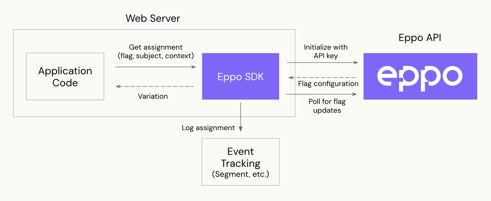

# Server SDKs

Eppo's server-side SDKs may be used to run experiments in your application server code. The below diagram shows the interactions of the SDK with Eppo's server:

1. **Initialization**: The SDK is designed to be initialized once when your application server starts up. Upon initialization, the SDK will begin polling Eppo's API at 5-minute intervals (not configurable) to retrieve experiment configurations. The experiment configurations such as variations and traffic allocation are stored in memory for quick lookup during assignment.

2. **Assignment**: The application server code invokes the SDK to assign a subject (e.g. user ID) to an experiment variation.

3. **Logging**: The SDK logs assignment events to whichever event tracking system you use (for example [Segment](https://segment.com/docs/)) using a callback function you provide on SDK initialization. The assignment data includes information about the assigned variation and subject.

### Globally Distributed Experiment Configurations

The SDK retrieves experiment data from a CDN that is globally distributed to over 100 edge locations. Each CDN location maintains a cache experiment data. 90% of requests are served by the CDN cache, while the remaining are handled by Eppo’s servers in the us-central GCP region. If there is a change to an experiment, such as an increase in traffic allocation, cached experiment configurations are updated within 10 minutes.

The SDK uses a background process to fetch and store the experiment data. The p75 latency of these requests is 50ms. This latency does not affect variation assignments, which use locally stored experiment data.

### Language-specific Documentation
- [Node](./node.md)
- [Python](./python.md)
