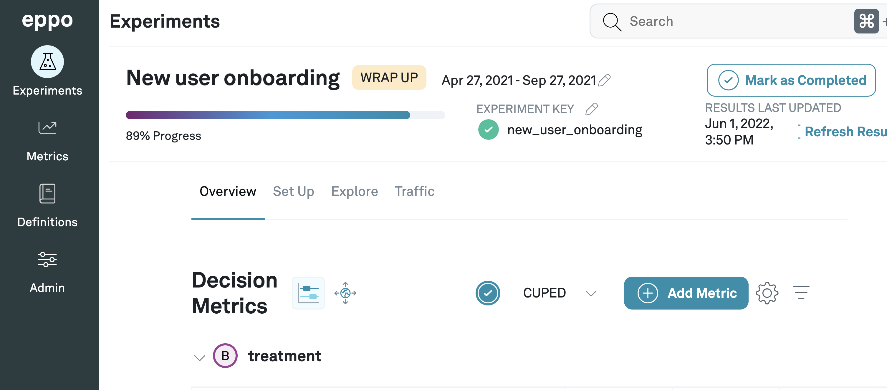

import Tabs from '@theme/Tabs';
import TabItem from '@theme/TabItem';

# Node

### 1. Install the SDK
You can install the SDK with Yarn or NPM:

<Tabs>
<TabItem value="yarn" label="Yarn">

```bash
yarn add @eppo/node-server-sdk
```

</TabItem>


<TabItem value="npm" label="NPM">

```bash
npm install @eppo/node-server-sdk
```

</TabItem>
</Tabs>

### 2. Initialize the SDK

Initialize the SDK once when your application starts up to generate a singleton client instance. The initialize method should be called once per application lifecycle; do not initialize the SDK on every request.

The SDK requires an assignment logging callback to be passed on initialization. The SDK uses the logging callback to capture assignment data whenever a variation is assigned. The below code examples shows how to integrate the SDK with [Segment](https://segment.com/docs/) for logging events, but you could also use any other logging system.

Define an implementation of the Eppo `AssignmentLogger` interface:

```javascript
import { IAssignmentLogger } from '@eppo/node-server-sdk';

// Connect to Segment (or your own event-tracking system)
const Analytics = require('analytics-node');
const analytics = new Analytics('<SEGMENT_WRITE_KEY>');

const assignmentLogger: IAssignmentLogger = {
  logAssignment(assignment) {
    analytics.track({
      userId: assignment.subject,
      event: 'Eppo Randomization Event',
      properties: assignment,
    });
  },
};
```

Initialize the SDK with the assignment logger from the above snippet and your API key. The `init` method should be called once on startup of your application server:

```javascript
import { init } from '@eppo/node-server-sdk';

await init({
  apiKey: '<API_KEY>',
  assignmentLogger,
});
```

After initialization, the SDK will begin polling Eppo’s API at regular intervals to retrieve the most recent experiment configurations such as variation values and traffic allocation. The Node SDK stores these configurations in memory for fast lookup by the assignment logic.

### 3. Assign Experiment Variations

The SDK requires two inputs to assign a variation:

- `experimentKey` - this should be the same as the “Experiment Key” field in Eppo as seen in the below screenshot
- `subjectKey` - the entity ID that is being experimented on, typically represented by a uuid.



The experiment **Traffic Allocation** setting determines the percentage of subjects the SDK will assign to experiment variations. If the experiment has zero experiment traffic allocation, you may still initialize the SDK in your application, but the SDK will return a `null` assignment if the `subject` input does not belong to the experiment sample population. For example, if the traffic allocation is 25%, the assignment function will return a variation for 25% of subjects and `null` for the remaining 75%. If the **Traffic Allocation** is zero but subjects have been added to a variation **Allow List**, the SDK will return the variation for the allow-listed subjects.

It may take up to 10 minutes for changes to the experiment configuration to be reflected by the SDK assignments.

The below code example shows how to assign a subject to an experiment variation:

```javascript
import * as EppoSdk from '@eppo/node-server-sdk';

const eppoClient = EppoSdk.getInstance();
const variation = eppoClient.getAssignment("<SUBJECT-KEY>", "<EXPERIMENT-KEY>");
```

### Links
- [GitHub repository](https://github.com/Eppo-exp/node-server-sdk)
- [NPM package](https://www.npmjs.com/package/@eppo/node-server-sdk)