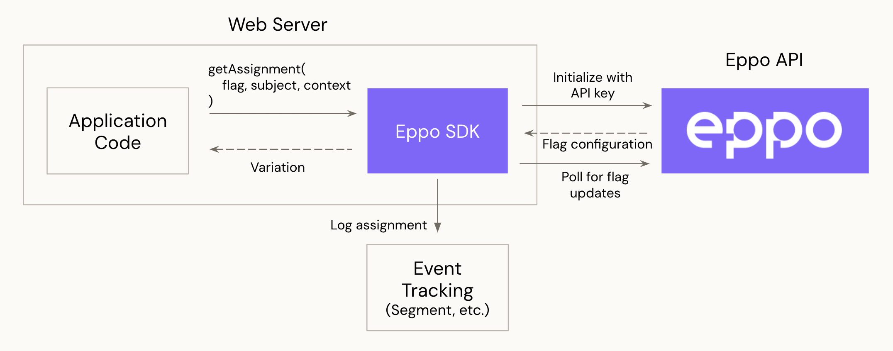

# Server SDKs

Eppo's server-side SDKs may be used to implement flags and run experiments in your application server code. The below diagram shows the interactions of the SDK with Eppo's server:

1. **Initialization**: The SDK is designed to be initialized once when your application server starts up. Upon initialization, the SDK begins polling Eppo's API at 5-minute intervals (not configurable) to retrieve flag/experiment configurations. The flag/experiment configurations such as variations and traffic allocation are stored in memory for quick lookup during assignment.

2. **Assignment**: The application server code invokes the SDK to assign a subject (e.g. user ID) to an experiment variation.

3. **Logging** (Experiments only): The SDK logs assignment events to whichever event tracking system you use (for example [Segment](https://segment.com/docs/)) using a callback function you provide on SDK initialization. The assignment data includes information about the assigned variation and subject.

### Language-specific Documentation
- [Node](./node.md)
- [Python](./python.md)
- [Java](./java.md)
- [Go](./go.md)
- [Ruby](./ruby.md)
