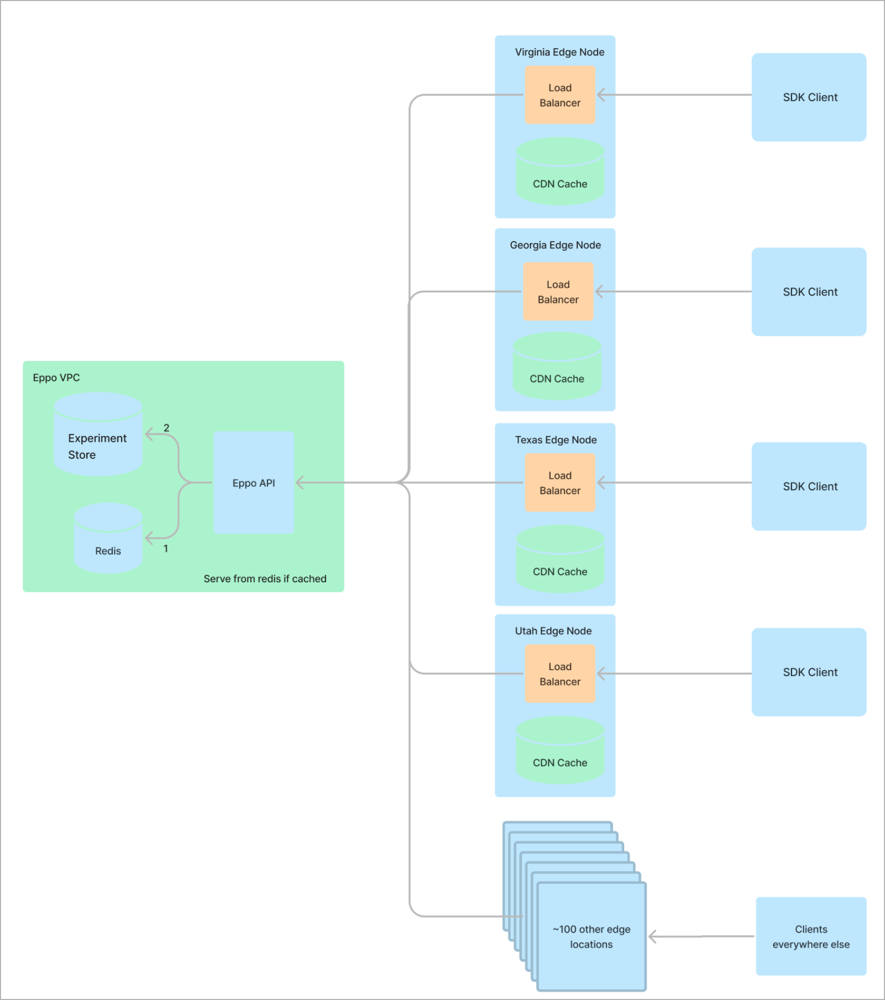

# Technical details

Technical details for engineers and engineering managers.

# SDK basics

Eppo feature flags and experiments are created and configured in our web interface. Those configurations are packaged and distributed by our internal API and served by our SDKs, which you embed in your application.

Eppo’s SDKs fetch configuration objects that are cached heavily by Google’s global CDN. This ensures that in the event of an Eppo outage, Eppo’s SDKs continue serving traffic as normal without interruption.

# Configuration caching

Eppo’s SDKs are durable and resilient by relying from Google’s globally distributed CDN which has over 100 edge nodes (read more [here](https://cloud.google.com/cdn/docs#docs)). Edge nodes maintain cached configuration objects and serve 90% of all of SDK requests. The remaining 10% of requests are handled by Eppo’s servers in the `us-central` GCP region. Changes to a flag from our dashboard, such as an increase in traffic allocation or a change to targeting, propagate to our SDKs within 10 minutes (the cache expiration time).

# Latency

Eppo’s SDKs use a background process to fetch and store configuration objects. The `p75` latency of these requests is 50ms. This latency does not affect variation assignments, which are effectively instant and use locally stored experiment data.

At Eppo we take pride in building functional systems that are also simple and  understandable systems. If you have questions around any of these topics please email us at feature-flagging@geteppo.com and we'll get back to you as soon as possible.