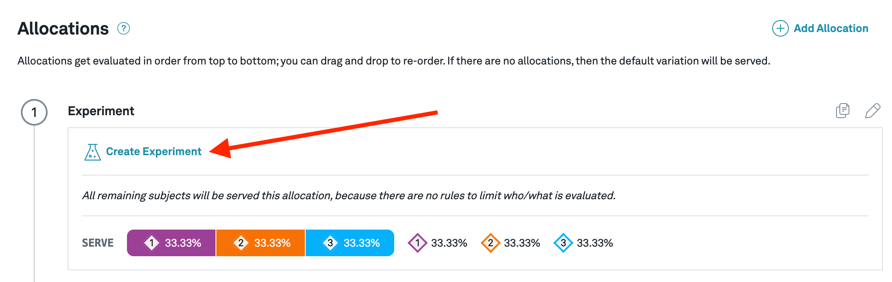

# Experiment assignment

Flags can be used to assign users into experiment buckets (i.e randomization) for A/B testing. Teams that use Eppo for assignments run their entire experimentation workflow through the tool. Unlike other flag use cases, set up of experiment assignments is managed on the `Experiments` section of the user interface.

### Create an experiment

To use Eppo for experiment assignment, begin by creating an experiment:

### Configure the experiment

When configuring the experiment, make sure to select `Use Eppo's Randomization` which lets the system know that you are using Eppo for both randomization and analysis:

Use the `Exposure and Targeting` section to limit which subjects are exposed to the experiment. Traffic exposure slices the entire population randomly, and rules let you target subjects more granularly by composing boolean logic using attributes from your app. In the example below we simply target 10% of all US Users (those where `country == 'US'`):

Next, create experiment variants under the `Variations` section. A `control` is created for you by default. Beyond that there is no limit on variation count.

Within each variation, optionally add a new-line separated list of subject IDs to force into that variation. **These forced subjects are recognized by Eppo SDKs before the experiment has started**, making them ideal for pre-launch internal QA. In the example below we create a single variation simply named `variation`:

Upon saving the configuration, you'll see instructions on how to implement the
experiment in your code for all available SDKs. Refer our SDK guides to initialize the right SDK for your stack.

Once initialized, to get an assigment for this experiment you'll call the experiment assignment function passing in a subject ID, the experiment key, and any attributes that your targeting logic depend on (in this example only `country` is needed):

### Start the experiment

Once the SDK has been set up in your code and the assignment code has been inserted, you are ready to run this experiment. Clicking the `Start Experiment`
will get the SDK to start assignments:

Once assignments have begun, they will need to be logged to your data warehouse to be analyzed by Eppo. All SDKs take in a callback function that is called with the assignment parameters (`subject_id`, `experiment_id`, `timestamp`, etc.) passed in when assignment are made. That function is completely managed by you - the only requirement is that the assignment data eventually makes it to your warehouse. Once an experiment has started you have the ability to pause assignments, increase the traffic exposure, and conclude the experiment.

Congrats on setting up your first Eppo randomized experiment! Refer to our analysis set up guide to connect Eppo to your data warehouse and easily analyze the results.