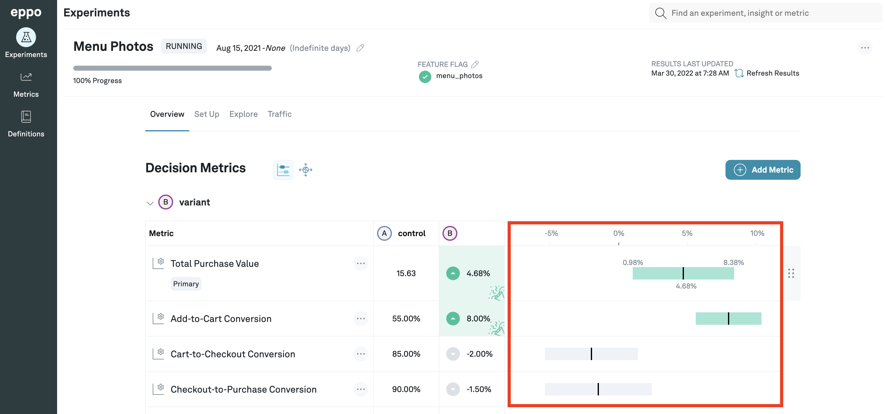

# Confidence Intervals
By navigating to the detail view of any experiment, you can view the effect that any of the treatments have had on each of the selected metrics for that experiment. You can get to the detail view of any experiment by clicking the **Experiments** tab on the left panel and then clicking on the experiment you're interested in from the list. The effect on each metric comes with an accompanying confidence interval. This confidence interval tells you the upper and lower bound of the effect on the metric in addition to the point estimate of the effect.

If the change is positive and a positive change has been marked as good, the interval shows up in green (red if positive is bad). The opposite is true if the change is negative. The interval will be gray if the confidence range includes 0, possibly indicating that the effect of the variation on that metric was not significant.

