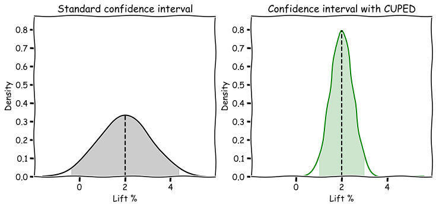
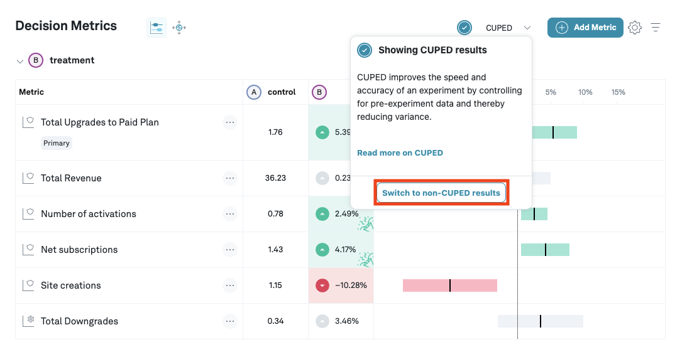
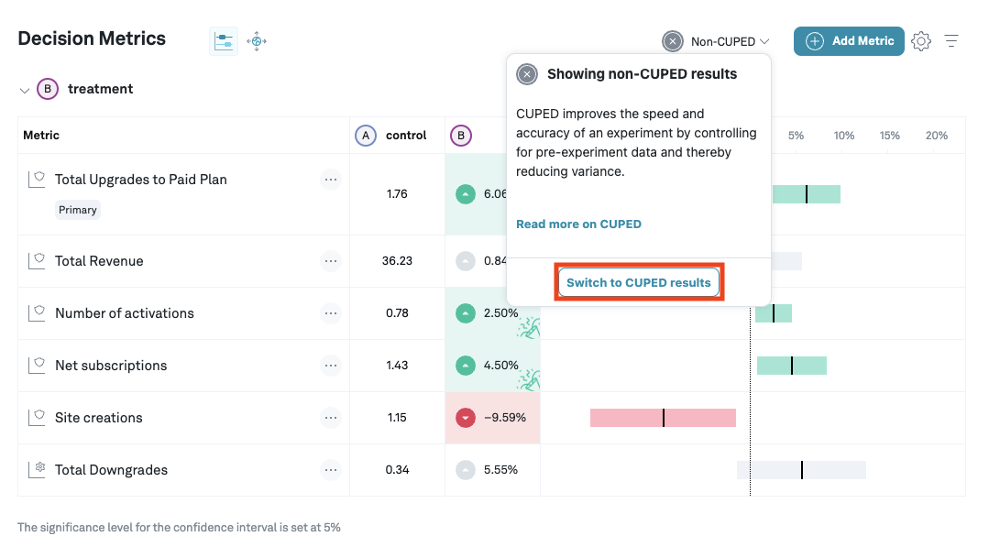

# Controlled-experiment Using Pre-Existing Data (CUPED)
The precision of experiment results (the width of confidence intervals) depends on the variance in of the metrics we are measuring. One way to improve the precision of experiments is to gather more data, as the variance goes down as we gather more data; this obviously means that it takes longer to run an experiment. 

owever, there are more direct ways to reduce variance, beyond just waiting for more data to show up.
However, there are options beyond waiting to gather more data, and all these options address reducing the variance in the metrics we are measuring directly. One particularly flexible and powerful method is known as CUPED. Standard experiment analysis involves comparing metric data from subjects exposed to a treatment to that of a control group -- all the data is gathered during the experiment. But most companies know something about their users beyond what they did during the experiment, most prominently metric data from before the experiment started. CUPED leverages this data from outside the experiment in order to control for some of the variance in metrics that comes from randomly picking variants for each subject; in a standard experiment, you might end up with one variant having more active users just by random chance, while CUPED reduces the effect of this random variation by controlling for the different activity levels across different variants. You can think of CUPED as a pair of noise cancelling headphones: it uses data gathered prior to the experiment to understand the ambient noise, allowing you to notice a more pronounced pattern in the data.

An illustration of how CUPED helps reduce the variance in an effect estimate, leading to a much tighter confidence interval.

Eppo uses CUPED to get more accurate estimates of treatment effect, which should lead to narrower confidence intervals.

## Overview
When CUPED is enabled, Eppo automatically ingests aggregated data about each subjects' events across metrics that are added to your experiment for the 30 days before they joined the experiment. Eppo then uses a ridge regression model to predict subject-level outcomes for each metric. For each metric, we predict outcomes using every available metric. These predictions are then used to get more accurate effect estimates, reducing the variance and hence leading to better confidence intervals. 

CUPED works best for experiments with long-time users for whom many pre-experiment data points exist. It is less effective for newer users; if you are running an experiment on a change in the onboarding flow for new users, there is no prior data to leverage, and hence there is little benefit. However, one appealing characteristic of our approach that you do not have to worry about CUPED giving you worse results. In the worst case scenario, it does equally well as the standard approach.

## Inner workings
The statistics behind CUPED quickly get quite involved. If you are looking for more details on our regression based approach, [this paper goes into depth on using regression adjustments for experimental data](https://projecteuclid.org/journals/annals-of-applied-statistics/volume-7/issue-1/Agnostic-notes-on-regression-adjustments-to-experimental-data--Reexamining/10.1214/12-AOAS583.full).

## Using CUPED on Eppo

You can switch between CUPED and non-CUPED results from the CUPED dropdown. 

CUPED can be turned on in the admin panel, and in the overview page of an experiment you can switch between CUPED and standard estimates. The models are updated once a day, but you can manually refresh upon changing the control variant or adding a new metric.

## Notes
- Conversion and retention metrics do not have a clear pre-experiment equivalent, which means that for experiments that only have conversion and/or retention metrics, CUPED does not work.
- We have plenty of improvements for CUPED planned; stay tuned for additional ways to improve your confidence intervals.