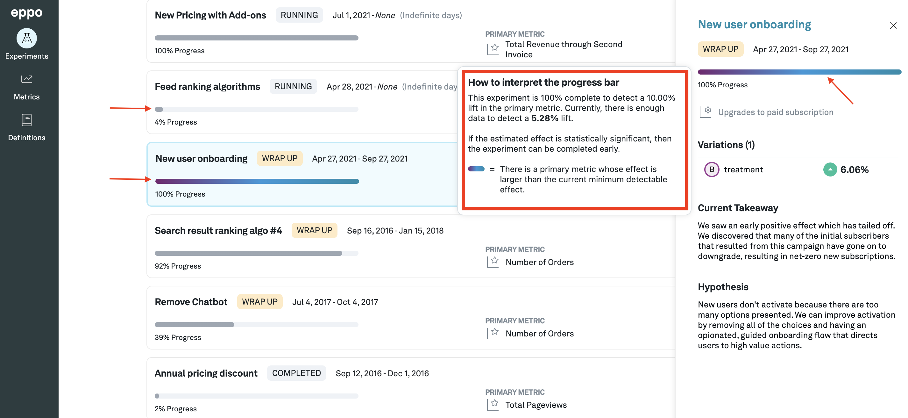
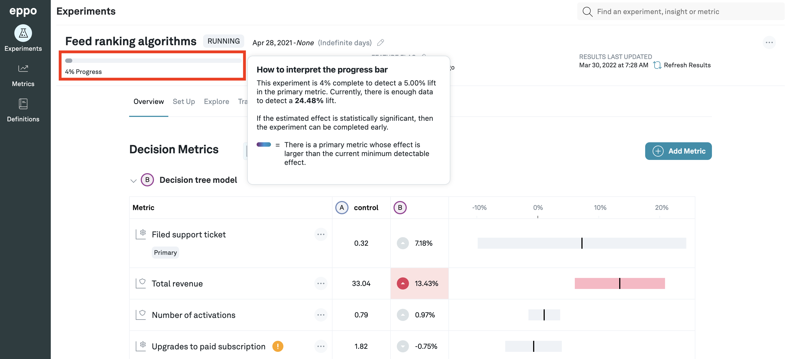
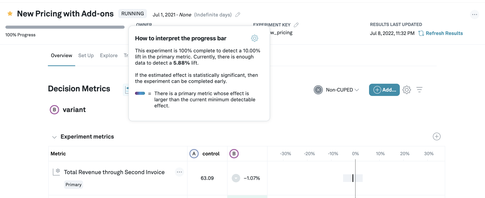
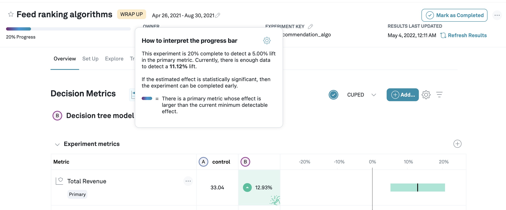

# Experiment Progress Bar

The progress bar helps we understand how much data we have gathered and whether it makes sense to continue gathering more data.

#### Minimum Detectable Effect
The progress of an experiment is measured with respect to the minimum detectable effect (MDE). This is the minimum effect size the experimenter is interested in being able to detect and is set at the metric level. However, it is possible to override this and set it to a particular value at the experiment level.

**Note:** A small MDE requires the experiment to run much longer to collect sufficient data.

### Progress Bar
The goal of the progress bar is to measure whether we have gathered enough data to make it highly likely that we can detect a meaningful lift in the primary metric, where meaningful means a lift of at least the MDE value configured for that experiment and that metric.

To view the progress bar, we must first navigate to the **Experiments** tab from the left panel. The progress bar can be seen in the list item card for each experiment in the experiment list. It can also be seen in the right panel if we click the card. Hovering over the progress bar shows we more details like the % lift that can be detected with the assignments seen so far.

we can also see the progress bar on the details page for each experiment.

**Note:** We compute the days remaining using a linear interpolation. This interpolation does not take into account that gathering data usually slows down during an experiment, and so the estimate may be optimistic, especially in the early days of an experiment.

### How to use the progress bar

Traditionally, when using a fixed sample test, we decide up front how long the experiment ought to run and cannot interpret results until we have finished gathering all data. However, the sequential testing approach we use allows for flexibility in deciding when to stop an experiment. Here's some advice on how to get the most out of the progress bar.

Before starting with any experiment, we have to set the MDE to something that makes sense for our use case. Two aspects are important:
- What constitutes a meaningful impact to the business: a 0.1% increase in revenue can be valuable for a company that operates at the scale of Google, but for a start-up that looks to grow 3x year over year, this would make for a negligible impact. 
- What effect sizes are we able to detect in a reasonable amount of time given the data volume. It's important to keep in mind that, as a rule of thumb, detecting an effect twice as small takes 4 times as long. Thus if based on our data volume it takes a month to detect a 10% lift, then it would take 4 months to detect a 5% lift. A constraint on the maximum time we are comfortable running an experiment often limits what MDE we can aim for.

Suppose, given the above considerations, we decide to set our MDE at 5%. We start our experiment, the progress bar begins to fill up. How should we use it to make decisions?

1. The _color_ of the progress bar indicates whether or not the primary metric is significant and positive. Blue indicates it is, gray indicates it is not.

2. The progress bar is an indicator of when it is safe to conclude there was no effect. If it is reaching 100% progress, and still grey, it is likely that there is no lift in our primary metric of at least the configured MDE size. Other metrics might show significant results, and might warrant shipping the treatment even though the primary metric is flat, however.

In the above example, we have set the minimum detectable effect at 10%, and we have gathered enough data to detect a much smaller effect of 5.88%. However, the results indicate that the primary metric hardly moved. We can stop this experiment due to a lack of any signs of a positive impact of the treatment over the control variant.

3. If the progress bar is blue, it means that our primary metric is better in the treatment variant, and that the difference is statistically significant. Because of the sequential analysis methods we use, it is safe to stop the experiment and ship it, even if the progress bar is not close to full. For example, if we see a lift of 20%, we know that we can detect such big lift about 4x sooner than the 5% lift we set as minimum detectable effect; we would see a positive result even though the progress bar is only at 25%. 

In this example, we see a roughly 13% increase in the primary metric, and we have gathered enough data to be powered to detect an 11% effect; even though we only see 20% progress towards detecting a 5% lift, we can stop this experiment early and conclude that the new variant improves upon the control.

In short: do not be afraid to conclude an experiment (long) before reaching 100% progress when we see significant results. 

Finally, keep in mind that the results we show are based on the period the data was collected. It is not uncommon to see strong weekly effects (users behave differently on Monday morning versuse Friday night), or novelty effects. Think about how reasonable it is to extrapolate results for the experiment period to a full roll-out, and when we see strong weekly effects, consider running the experiment for at least a week, and in increments of a week, no matter what the results tell we.

## Mathematical details of computing progress
Because we use sequential analysis to produce confidence intervals, this is not straightforward and we resort to the following heuristic: the current detectable effect (CDE) is computed by multiplying the confidence bound by $\frac{z_{1-\alpha/2} + z_{\text{power}}}{z_{1-\alpha/2}}$, where $z_x = \Phi^{-1}(x)$ corresponds to the inverse CDF evaluated at $x$, where we use 80% power by default. This bound is exact when running a Z-test with 80% power [reference](http://www.stat.columbia.edu/~gelman/stuff_for_blog/chap20.pdf).

We then define progress as $\text{Progress} = \left(\frac{\text{MDE}}{\text{CDE}}\right)^2$. The square comes from the fact that if we want to detect an effect twice as small, we need roughly 4 times more data.
