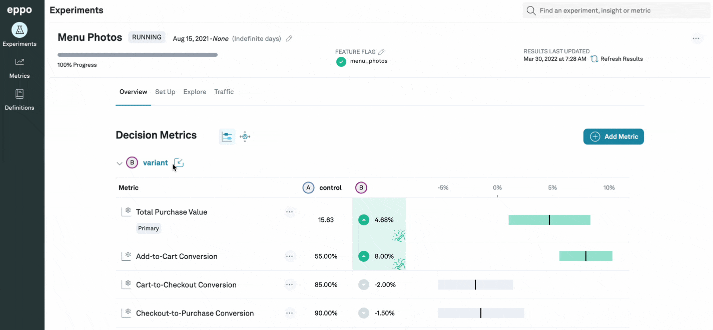
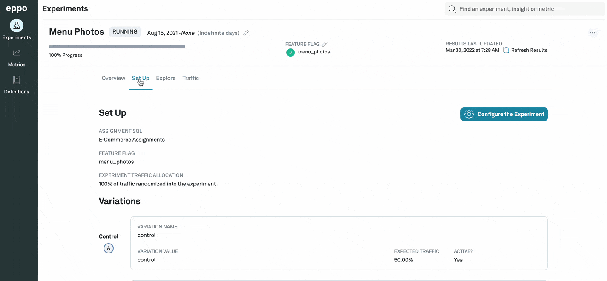

# Adding Screenshots
In your experiments, you can add screenshots to your different variations. You can use these screenshots to highlight the changes made in the variation.

To do this, first navigate to the **Experiments** tab on the left and then click on your experiment. Then click on the icon next to the variant you want to add the screenshot to.

For example, let us say you are running an experiment to see how adding photos to the customer's menu affects the menu-to-cart conversion. In this case, you can add screenshots of the new updated menu to the corresponding variant in the experiment.

You can also add a screenshot for the original control variant to make the comparison between the changes easier.

