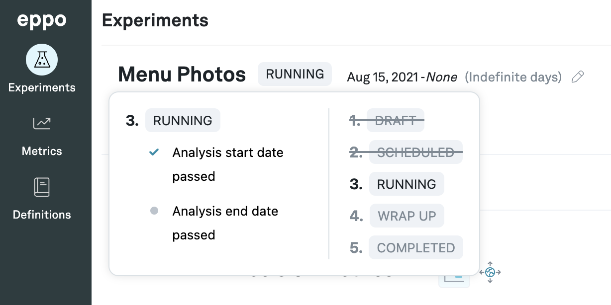

# Experiment Status

Each experiment has an associated status which indicates the current condition of the experiment. An experiment can have one of 5 different statuses:
1. Draft - this is the initial state when you are actually creating the experiment
2. Scheduled - once you connect the feature flag the experiment moves into the scheduled state
3. Running - the experiment moves to this state as soon as the start date has passed
4. Wrap Up - once you move past the end date, the experiment moves to the wrap up state
5. Completed - after wrapping up, you can fill in some additional details and mark the experiment complete

If you go on to the details page for an experiment and hover over the status tag, you can view more details about the status.

