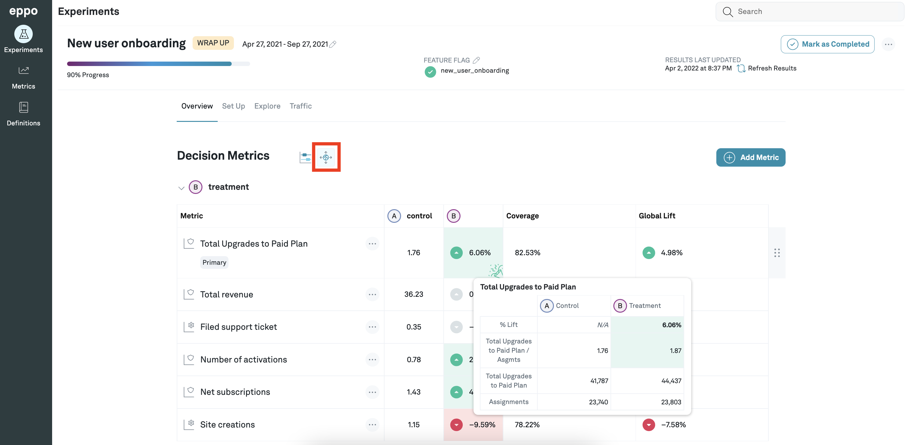

# Global Lift
You can see the global lift for the metrics in your experiment. To do this, first navigate to the **Experiments** page using the tab on the left panel and click on the experiment you are interested in. Then, stay on the **Overview** tab and click on the Impact Accounting icon, which is the second icon next to the heading **Decision Metrics**.

The **B** column tells you the lift for that metric in the experiment. The **Global Lift** column tells you the lift for that metric by taking the **Coverage** for that metric into account. 

For example, suppose that you are running an experiment on your mobile app which shows that revenue is up by 50% (lift). However, if only 10% of your total users actually use your mobile app, the actual impact on your bottom line is only 5% (global lift).
