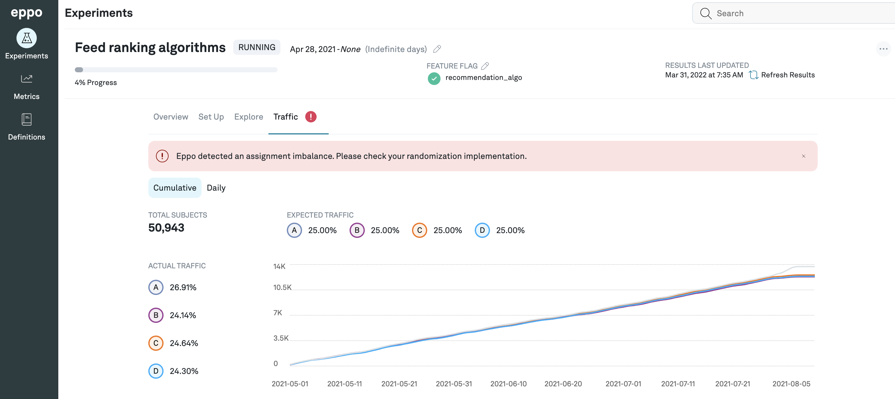

# Traffic and Traffic Inbalances

The details page for each experiment contains a Set Up page where you can configure the % of traffic you want to randomize into the experiment.

The **Traffic** tab shows you a comparison of the traffic seen between the variants being considered for the experiment. You can also toggle between seeing the cumulative, or daily traffic.

You can also see how the actual traffic differs from the actual traffic you were exepecting to see. If there is an inbalance, you will see a warning next to the tab and above the graph.

