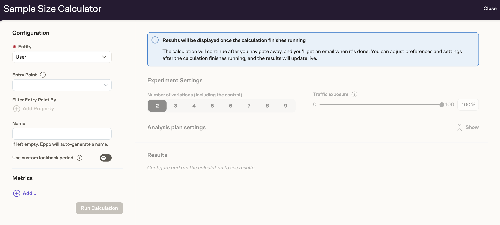
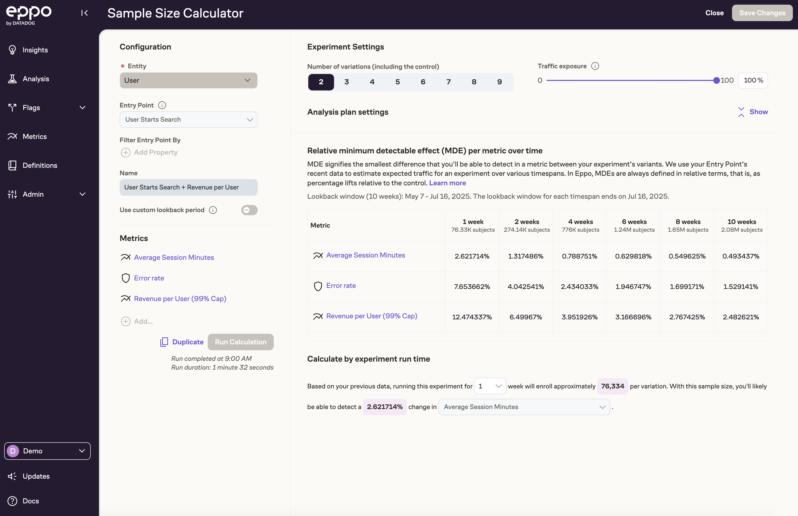

# Using the Sample Size Calculator

An experiment’s statistical power, or ability to detect treatment effects in a particular metric, is determined the number of subjects in the experiment, as well as that metric’s mean and variance. Eppo provides a dedicated interface for computing [Minimum Detectable Effects](./minimum_detectable_effects) for various experiment runtimes using historical data in your data warehouse. To use Eppo’s **Sample Size Calculator**, you or someone at your company will first need to [set up one or more Entry Points](./setting_up_the_sample_size_calculator#creating-entry-points). The rest of this article assumes that an Entry Point has been configured, and that you are ready to perform a sample-size calculation.

Open up the **Sample Size Calculator** using the button in the top-right corner of the Experiments page and choose the [entity](../building-experiments/entities/) for which you plan to run an experiment. 

After choosing your Entry Point, you will be able to calculate Minimum Detectable Effects over time for various metrics of interest.

The controls on the left allow you to define the configuration of the planned experiment. The two most important controls are the Number of Variations and the Traffic Exposure. The Number of Variations includes the Control, and so has a minimum value of 2. Traffic Exposure refers to the percent of traffic (that is, of observed entries) that you plan to enroll in the experiment. Combined with the simulated experiment data, these two numbers will determine the number of subjects available for the planned experiment over various time periods.

This number will be visible after adding your first metric to the planned experiment. To do so, click *Add Metrics* on the right, and use the control to select a metric whose Minimum Detectable Effect you wish to calculate.

After selecting a metric, a table will appear that summarizes the Minimum Detectable Effect that you can expect to observe after various experiment run-times. The numbers that you see in the table take into account the metric’s most recently observed mean and variance, as well as the number of unique entity IDs that were observed in the Entry Point data for each time period.

In statistical terms, [Minimum Detectable Effect (MDE)](./minimum_detectable_effects) is defined as the smallest lift that can be detected a certain percent of the time, while ensuring that the experiment's confidence intervals contain the true value a specified percent of the time; these two numbers (called Power and Confidence Level) can be configured under Advanced Settings, on the left. You may notice while using those controls that higher power and confidence levels correspond to larger Minimum Detectable Effects for all metrics.

Often it is desirable to compute MDEs for several metrics at once to ensure that several metrics of interest will achieve a given MDE. You can add more than one metric to the table using the *Add...* control in the top-right corner. You can remove a metric from the table using the Actions (...) control next to each metric name.

Below the main table interface, you will find a natural-language presentation of the same data. This interface may be useful for explaining the MDE calculation to others.

Once you have determined the experiment runtime that will achieve the desired MDE, you can close the interface and proceed to set up a new experiment.

## Statistical Details

Eppo supports both fixed-sample confidence intervals as well as sequential confidence intervals. The type of confidence interval will determine the formula that is used for each metric’s MDE.

For fixed-sample experiments, the relative Minimum Detectable Effect is given by

$$
MDE_{fixed}=(z_{\alpha/2}+z_{\beta})\sqrt{2\hat{\sigma}^2/N}/\hat{\mu}
$$

Where:

- $z_{\alpha/2}$ and $z_\beta$ correspond to z-scores of the selected significance level and power
- $\hat{\sigma}^2$ and $\hat{\mu}$ represent the metric’s estimated mean and variance over the chosen time period
- $N$ represents the number of subjects that will be assigned to each variation, using the estimated traffic for the time period, the number of variations, and the traffic allocation percentage.

The sequential version of the Minimum Detectable Effect is similar, but scaled by the width of a sequential confidential interval relative to a fixed-sample confidence interval.