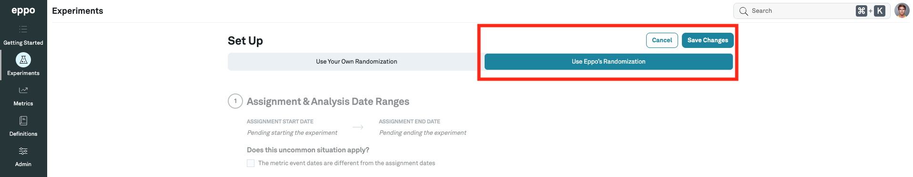

import Tabs from '@theme/Tabs';
import TabItem from '@theme/TabItem';

# JavaScript

:::note
This documentation is for our client-side SDK intended for use by browser applications. For use in server applications, refer to our [Node JS SDK](../server-sdks/node.md).
:::

Eppo's JavaScript SDK is open source:
- [GitHub repository](https://github.com/Eppo-exp/js-client-sdk)
- [API Reference](https://eppo-exp.github.io/js-client-sdk/js-client-sdk.html)
- [NPM package](https://www.npmjs.com/package/@eppo/js-client-sdk)

### 1. Install the SDK
You can install the SDK with Yarn or NPM:

<Tabs>
<TabItem value="yarn" label="Yarn">

```bash
yarn add @eppo/js-client-sdk
```

</TabItem>


<TabItem value="npm" label="NPM">

```bash
npm install @eppo/js-client-sdk
```

</TabItem>

<TabItem value="script" label="Script">

```html
<script src="https://cdn.jsdelivr.net/npm/@eppo/js-client-sdk@latest/dist/eppo-sdk.min.js"></script>
```

If you install via a `<script>` tag, include a version in the URL to install a specific version of the SDK (or use `latest` as the version to install the latest SDK version):

```html
<script src="https://cdn.jsdelivr.net/npm/@eppo/js-client-sdk@{version}/dist/eppo-sdk.min.js"></script>
```
</TabItem>
</Tabs>


### 2. Define an Assignment Logger

The SDK requires an assignment logger to be passed on initialization. The SDK invokes the logger to capture assignment data whenever a variation is assigned. The below code example shows how to integrate the SDK with [Segment](https://segment.com/docs/) for logging events. You could also use your own logging system; the only requirement is that the SDK receives a `logAssignment` function.

Define an implementation of the Eppo `AssignmentLogger` interface. This interface has one function: `logAssignment`.

```javascript
import { IAssignmentLogger } from '@eppo/js-client-sdk';
import { AnalyticsBrowser } from '@segment/analytics-next'

// Connect to Segment (or your own event-tracking system)
const analytics = AnalyticsBrowser.load({ writeKey: '<SEGMENT_WRITE_KEY>' })

const assignmentLogger: IAssignmentLogger = {
  logAssignment(assignment) {
    analytics.track({
      userId: assignment.subject,
      event: 'Eppo Randomized Assignment',
      type: 'track',
      properties: { ...assignment }
    });
  },
};
```

The SDK will invoke the `logAssignment` function with an `assignment` object that contains the following fields:

| Field | Description | Example |
| --------- | ------- | ---------- |
| `experiment` (string) | An Eppo experiment key | "recommendation_algo" |
| `subject` (string) | An identifier of the subject or user assigned to the experiment variation | UUID |
| `variation` (string) | The experiment variation the subject was assigned to | "control" |
| `timestamp` (string) | The time when the subject was assigned to the variation | 2021-06-22T17:35:12.000Z |
| `subjectAttributes` (map) | A free-form map of metadata about the subject. These attributes are only logged if passed to the SDK assignment function | `{ "country": "US" }` |

### 3. Initialize the SDK

Initialize the SDK with the event logger from the previous section and your API key.:

```javascript
import { init } from '@eppo/js-client-sdk';

await init({
  apiKey: '<API_KEY>',
  assignmentLogger,
});
```

The `init` method downloads your Eppo experiment configurations once per browser session.

:::note
API Keys used with Client SDKs should have only ‘Randomization READ’ permissions
:::

### 4. Assign Experiment Variations

Before using the SDK to assign a variation, make sure your experiment is setup as follows:
1. The experiment must be configured to use Eppo's randomization:


2. The experiment must be started **OR** the `subjectKey` passed to the SDK must be added to one of its variation allow lists


If the above conditions are not met, the SDK will return `null` as the assignment.

:::note
It may take up to 5 minutes for changes to Eppo experiments to be reflected by the SDK assignments.
:::

The experiment **Traffic Allocation** setting determines the percentage of subjects the SDK will assign to experiment variations. For example, if the traffic allocation is 25%, the assignment function will return a variation for 25% of subjects and `null` for the remaining 75%. If the **Traffic Allocation** is zero but subjects have been added to a variation **Allow List**, the SDK will return the variation for the allow-listed subjects.

The SDK requires two inputs to assign a variation:
- `experimentKey` - this should be the same as the “Experiment Key” field of an Eppo experiment
- `subjectKey` - the entity ID that is being experimented on, typically represented by a uuid.

The below code example shows how to assign a subject to an experiment variation:

```javascript
import * as EppoSdk from '@eppo/js-client-sdk';

const eppoClient = EppoSdk.getInstance();
const variation = eppoClient.getAssignment("<SUBJECT-KEY>", "<EXPERIMENT-KEY>");
```

If `getAssignment` is invoked before the SDK has finished initializing, the SDK may not have access to the most recent experiment configurations. In this case, the SDK will assign a variation based on any previously downloaded experiment configurations stored in local storage, or return null if no configurations have been downloaded.

### Usage in React

For usage in React, we recommend using the below `EppoRandomizationProvider` at the root of your component tree. By default, this component waits for initialization of the SDK before rendering its children. If `waitForInitialization` is set to false, the SDK `getAssignment` function will return `null` assignments while initializing and will only start assigning subjects when a new browser session is started.

```tsx
import { useEffect, useState } from 'react';

import { init } from '@eppo/js-client-sdk';

interface IEppoRandomizationProvider {
  waitForInitialization?: boolean;
  children: JSX.Element;
  loadingComponent?: JSX.Element;
}

export default function EppoRandomizationProvider({
  waitForInitialization = true,
  children,
  loadingComponent = <div>Loading...</div>,
}: IEppoRandomizationProvider): JSX.Element {
  const [isInitialized, setIsInitialized] = useState(false);
  useEffect(() => {
    init({
      apiKey: "<YOUR-API-KEY>",
      assignmentLogger: {
        logAssignment(assignment) {
          // logging implementation
        },
      },
    }).then(() => {
      return setIsInitialized(true);
    })
  }, []);

  if (!waitForInitialization || isInitialized) {
    return children;
  }
  return loadingComponent;
}
```

After the SDK is initialized, you may assign variations from any child component of `EppoRandomizationProvider`. We recommend wrapping the SDK code in a [useMemo hook](https://reactjs.org/docs/hooks-reference.html#usememo) to avoid invoking the assignment logic on every render:

```tsx
<EppoRandomizationProvider>
  <MyComponent />
</EppoRandomizationProvider>
```

```tsx
function MyComponent(): JSX.Element {
  const assignedVariation = useMemo(() => {
    const eppoClient = getInstance();
    return eppoClient.getAssignment("<SUBJECT-KEY>", "<EXPERIMENT-KEY>");
  }, [])

  return (
    <div>
      { assignedVariation === '<VARIATION-KEY>' && <p>Assigned control</p>}
    </div>
  );
}
```

### Browser Support

The SDK is supported on all modern browsers. It relies on JavaScript promises, which may not be supported on older browsers including IE. If you need to run the SDK on a browser that does not support promises, it is possible to use a [polyfill library](https://www.npmjs.com/package/promise-polyfill).

### Local Storage

The SDK uses browser local storage to store experiment configurations downloaded from Eppo. This allows for quick lookup by the `getAssignment` function. The configuration data stored contains the experiment key, experiment variation values, traffic allocation, and any allow-list overrides.
