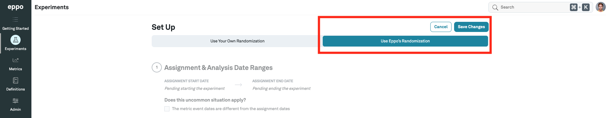
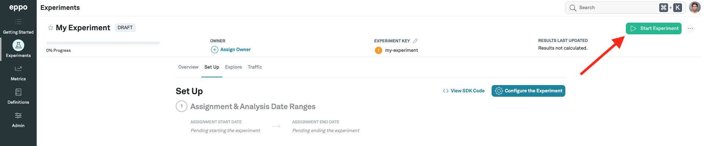

import Tabs from '@theme/Tabs';
import TabItem from '@theme/TabItem';

# JAVA

Eppo's Java SDK is open source:
- [GitHub repository](https://github.com/Eppo-exp/java-server-sdk)
- [Package](https://s01.oss.sonatype.org/#nexus-search;quick~eppo-server-sdk)

### 1. Install the SDK
In your pom.xml, add the SDK package as a dependency:

```
<dependency>
  <groupId>cloud.eppo</groupId>
  <artifactId>eppo-server-sdk</artifactId>
  <version>1.0.0</version>
</dependency>
```

### 2. Define an Assignment Logger

The SDK requires an assignment logger to be passed on initialization. The SDK invokes the logger to capture assignment data whenever a variation is assigned. The below code example shows how to create your own assignment logger.

Define an implementation of the Eppo `IAssignmentLogger` interface. This interface has one function: `logAssignment`.

```java
import com.eppo.sdk.dto.IAssignmentLogger;
import com.eppo.sdk.dto.AssignmentLogData;

public class AssignmentLoggerImpl implements IAssignmentLogger {
  public void logAssignment(AssignmentLogData event) {
    ...
  }
}
```

The SDK will invoke the `logAssignment` function with an `event` object that contains the following fields:

| Field | Description | Example |
| --------- | ------- | ---------- |
| `experiment` (string) | An Eppo experiment key | "recommendation_algo" |
| `subject` (string) | An identifier of the subject or user assigned to the experiment variation | UUID |
| `variation` (string) | The experiment variation the subject was assigned to | "control" |
| `timestamp` (Date) | The time when the subject was assigned to the variation | 2021-06-22T17:35:12.000Z |
| `subjectAttributes` (Map<String, String>) | A free-form map of metadata about the subject. These attributes are only logged if passed to the SDK assignment function | `{ "country": "US" }` |

### 3. Initialize the SDK

Initialize the SDK once when your application starts up to generate a singleton client instance. During initialization, the SDK does a network request to fetch experiment configurations, which it stores in memory. It's only necessary to initialize the SDK once per application lifecycle.

The below code example shows how to initialize the SDK with the event logger from the previous section and your API key:

```java
EppoClientConfig config = EppoClientConfig.builder()
        .apiKey("<api-key>")
        .assignmentLogger((data) -> System.out.println(data.toString()))
        .build();
EppoClient eppoClient = EppoClient.init(config);
```

After initialization, the SDK will begin polling Eppo’s API at regular intervals to retrieve the most recent experiment configurations such as variation values and traffic allocation. The JAVA SDK stores these configurations in memory for fast lookup by the assignment logic.

### 4. Assign Experiment Variations

Before using the SDK to assign a variation, make sure your experiment is setup as follows:
1. The experiment must be configured to use Eppo's randomization:

2. The experiment must be started **OR** the `subjectKey` passed to the SDK must be added to one of its variation allow lists


If the above conditions are not met, the SDK will return `Optional.empty()` as the assignment.

:::note
It may take up to 5 minutes for changes to Eppo experiments to be reflected by the SDK assignments.
:::

The experiment **Traffic Allocation** setting determines the percentage of subjects the SDK will assign to experiment variations. For example, if the traffic allocation is 25%, the SDK will assign a variation for 25% of subjects and no assignment for the remaining 75% (unless the subject is part of an allow list).

The SDK requires two inputs to assign a variation:
- `experimentKey` - this should be the same as the “Experiment Key” field of an Eppo experiment
- `subjectKey` - the entity ID that is being experimented on, typically represented by a uuid.

The below code example shows how to assign a subject to an experiment variation:

```java
Optional<String> assignedVariation = eppoClient.getAssignment("<SUBJECT-KEY>", "<EXPERIMENT-KEY>");
```
