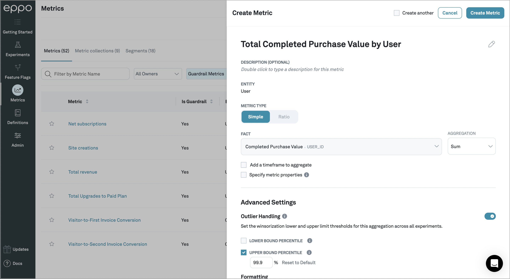

# Creating your first metric

:::info
In order to create a metric, you must have a data warehouse connected and an entity created. See [the initial setup quickstart](/setup-quickstart) for details.
:::

Metrics are standardized definitions of where data lives in your data warehouse and how it should be used to analyze experiments. In this guide, you'll create a Fact SQL definition to tell Eppo where data lives, and create a metric definition to standardize how this data should be used to analyze experiments.

### 1. Create a Fact SQL definition

Fact SQLs define events, like sign-ups, activations, or orders. Together, Assignment and Fact SQLs give a picture of what happened to different segments of users shown different variants of the experiment.

Follow the steps below to create your first Fact SQL definition.

1. Navigate to the **Definitions** page, click **+Create Definition SQL**, then click **Fact SQL**
2. Name your Fact SQL
3. Write SQL to return event data from within your data warehouse. At a minimum, the SQL should return a unique identifier (e.g., `user_id`) and a timestamp. You can optionally include numeric values (e.g., purchase price) and [fact properties](/data-management/definitions/properties#metric-properties) to later slice results (e.g., device type).
4. Specify the timestamp and entity id columns
5. Create Facts for any columns from which you plan to build metrics, or select "Each Record"
6. Click **Save and close**

### 2. Create a Metric

Metrics specify how the raw event data you defined above should be aggregated for experiment analysis. Follow the steps below to create your first metric.

1. Navigate to the **Metrics** page and click **+Create**
2. Select the relevant entity
3. Select the fact you would like to aggregate and the relevant [aggregation method](/data-management/metrics/simple-metric#metric-aggregation-types)
4. (Optional) Set metric time window (relative to experiment assignment), and Winsorization settings
5. Hit **Create Metric** and repeat for any other metrics you would like to create

You have now created your first metric! Next, check out our quick start on [running your first experiment](/feature-flag-quickstart) or [analyzing a past experiment](/experiment-quickstart/).
