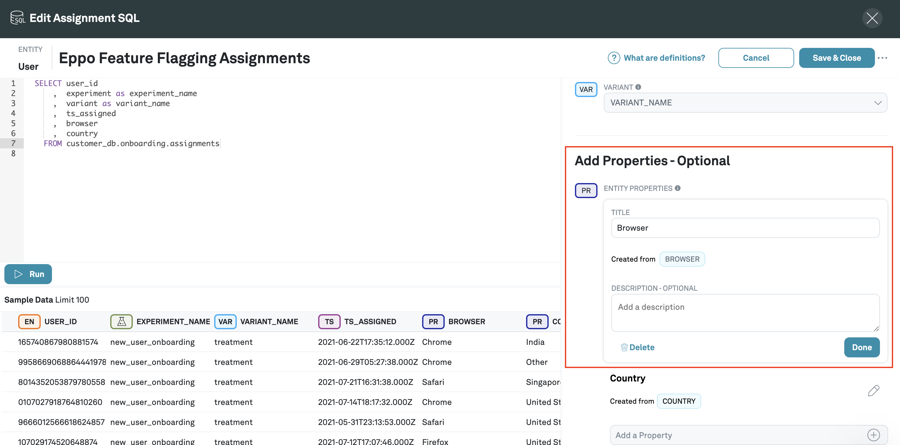
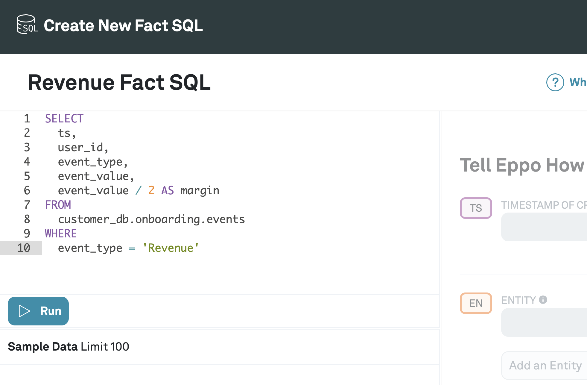
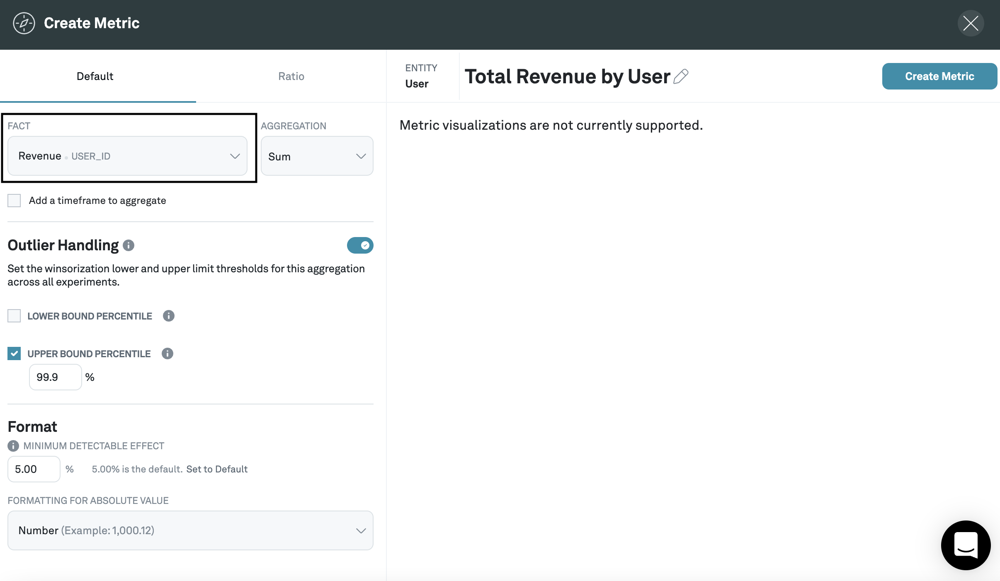

# Quickstart

Follow this quickstart to get your first experiment set up on Eppo.

## Overview

0. [Prep your data warehouse and set up feature flagging](#0-prep-your-data-warehouse-and-set-up-feature-flagging)
1. [Create an Eppo account](#1-create-eppo-account)
2. [Connect your data warehouse](#2-connect-your-data-warehouse)
3. [Create an Assignment SQL](#3-create-an-assignment-sql)
4. [Create Fact SQLs](#4-create-a-fact-sql)
5. [Create metrics](#5-create-metrics)
6. [Create an experiment](#6-create-an-experiment)
7. [Add metrics to experiment](#7-add-metrics-to-experiment)

## 0. Prep your data warehouse and set up feature flagging

Eppo assumes that you are already using a third party feature flagging tool like [LaunchDarkly](https://launchdarkly.com/) or [Optimizely](https://www.optimizely.com/) and are exporting experiment data into a data warehouse. In particular, Eppo requires that you have the following tables in your data warehouse:

- An assignment table that indicates which experiment subjects were assigned to which experiments and variants at which time. It should [contain columns](./connecting-your-data/assignment-tables/required-data)  that roughly correspond to:

    | timestamp | user_id | experiment | variation |
    | --------- | ------- | ---------- | --------- |
    | 2021-06-22T17:35:12.000Z | 165740867980881574 | adding_BNPL_experiment | affirm |

- An event table whose rows are logs of specific events that occurred at specific times. It should contain columns that roughly correspond to:

    | timestamp | user_id | event_type | event_value |
    | --------- | ------- | ------- | -------------- |
    | 2021-07-17T18:57:13.000Z	 | 49980400511307080 | Revenue | 45.5695	|
    | 2021-07-17T18:57:13.000Z	 | 2281323415877132491 | Subscription | 1 |

If you do not have a feature flagging tool integrated, please refer to the [feature flagging](./feature-flagging/) section for more instructions.

If you have a feature flagging tool integrated but do not have an assignment table set up in your data warehouse, please follow the instructions [here](./connecting-your-data/assignment-tables/) to log your assignment data.

## 1. Create Eppo account

Create a new account at https://eppo.cloud/. Eppo implements Auth0 and you should be able to sign in with any of the providers that Auth0 supports, including Google.

## 2. Connect your data warehouse

Once you log in, you will see a fill form where you can input your data warehouse connection details.

Follow the linked warehouse-specific guides to connect Eppo to your data warehouse.

- [Snowflake](./connecting-your-data/data-warehouses/connecting-to-snowflake)
- [BigQuery](./connecting-your-data/data-warehouses/connecting-to-bigquery)
- [RedShift](./connecting-your-data/data-warehouses/connecting-to-redshift)

## 3. Create an Assignment SQL

Now that Eppo is connected to your data warehouse, the first thing we are going to do is create an Assignment SQL. Assignment SQLs define which experiment subjects will be assigned to which experiment and variation, and at what time. They're basically just pulling data from your assignment table.

1. Navigate to **Definitions** on the left hand menu and click **+Create Definition SQL**, then click **Assignment SQL**

2. Select the subject of the Assignment SQL

Entities are the randomization units of your experiment. By default, entities in Eppo are **User**, but you can also [create your own custom entities](./building-experiments/entities.md) and attach Assignment SQL's to them.

3. Name your Assignment SQL

4. Write SQL in the SQL editor to pull assignments from data warehouse and click **Run**

Recall in the [Set up Feature Flagging](#0-prep-your-data-warehouse-and-set-up-feature-flagging) section that you should have an assignment table in your data warehouse with certain column types.

In this step, you're going to write SQL to pull that data.

Then click **Run**, and the rows from that assignment table should appear in the bottom left.

5. Annotate the columns that you've selected from the data warehouse

In case there's any ambiguity as to which properties the columns correspond to, we annotate them here.

6. Make note of your feature flag name and variant names

Note the value of the **FEATURE FLAG** column; in this example it's `new_user_onboarding` - this is your feature flag name.

Note the values of the **VARIANT** column; in this example it's `control` and `treatment` - these are the names of your variants.

You will need these names later.

7. Adding optional dimensions

Your feature flag tooling may have logged additional data about the user, like what country they're from or which browser they're using. You can annotate these additional dimensions here, and they will show up under the **Dimension SQL** tab.

8. Click **Save & Close**

You've created your first Assignment SQL!

## 5. Create a Fact SQL

Fact SQL's define events, like sign-ups, activations, or orders. Together, the Assignment SQL and Fact SQLs give us a picture of _what happened_ to different segments of users shown different variants of the experiment.

1. Navigate to **Definitions** on the left hand menu, click **+Create Definition SQL**, then click **Fact SQL**

2. Select **User** as the entity

**User** is the default entity in Eppo but you can also create your own [custom entity](./building-experiments/entities.md) and select that here.

3. Name your Fact SQL

4. Write SQL in the SQL editor to pull events data from the data warehouse

Recall in the [Set up Feature Flagging](#1-set-up-feature-flagging) section that you should have (potentially multiple) event tables in your data warehouse with certain column types.

In this step, you're going to write SQL to pull that data.

5. Annotate the columns that you've selected from the data warehouse

In the example above, Eppo has already automatically determined that the `timestamp of creation` column is `TS` and the relevant `entity id` column is `USER_ID`.

6. Add Facts

For every event that you want to track, you should add its corresponding column in the data warehouse as a fact.

In the example above, we would like to measure the effect of the experiment on `revenue`.

In the data warehouse, every time there is a revenue event (that might be someone purchasing something), that event is logged as a row in the data warehouse.

This event is translated into an integer value, which is the revenue amount, that can then be used as an Eppo fact and tracked in an experiment.

7. Click **Save & Close**

You've now created your first Fact SQL. If you have more events that you would like to track in your experiment, you can repeat the steps in this section to create additional Fact SQLs.

## 6. Create metrics

1. Navigate to **Metrics**, click **+Metric**, then select **User** as the subject of the metric

**User** is the default entity in Eppo, but you can also create a [custom entity](./building-experiments/entities.md) and select it here.

2. Select a fact

This should be one of the facts that you created in the step above, and should correspond to a metric that you want to track in an experiment.

3. Select an aggregation

The aggregation will aggregate over whatever the fact is measuring on a per-entity basis. So for example, if you select the `Revenue` fact and the `SUM` aggregation, the metric will be the total revenue for each user; if you select the `Upgrades` fact and the `SUM` aggregation, the metric will be the total number of upgrades for each user, which should only be 1 across the board.

Eppo supports the following aggregations:

- SUM
- COUNT DISTINCT
- COUNT
- RETENTION
- CONVERSION

4. (Optional) Select a Filter

When you created an assignment SQL above, you may have also created additional dimensions, i.e. country or browser. These dimensions are now available under the **Definitions** > **Dimensions SQL**.

Here, you can filter on any of those dimensions. In the example above, we want to track the revenue metric by country.

5. Select a minimum detectable effect

The minimum detectable effect refers to the smallest effect you want to reliably detect in experiments. The higher the minimum detectable effect you set, the longer the experiment will take to reach conclusive results.

## 7. Create an experiment

### Configure the experiment

1. Navigate to **Experiments** in the left-hand menu and click **+Experiment**

2. Fill out the **Create Experiment** Form

Give your experiment a name, start and end date. You can optionally provide no end date if you would like the experiment to run indefinitely. Refer to the [best practices guide](./running-successful-experiments/index.md) if you're not sure how long you would like the experiment to run.

3. Navigate to the **Set Up** tab and click the **Configure the Experiment** button

6. Select the Assignment SQL that you created previously

7. Input feature flag name

When you created your Assignment SQL, you should have made note of your feature flag name. In our case it's `new_user_onboarding`.

8. Input what percentage of traffic you want randomized into the experiment.

If you input 100%, 100% of the relevant entities (users in this case) will be included in the experiment.

9. Add the variants

When you created your assignment SQL, you should have made note of your variant names. In our case here it's `control` and `variant`.

You can go ahead and add each variant into the experiment here.

10. Select the traffic allocation you would like

The default is an even split between all the variants (including control), but you can also customize the allocation for unequal splits.

11. Click **Save Changes**

### 8. Add metrics to experiment

1. Navigate to **Experiments** and click the **Overview** tab

Under **Decision metrics**, you will see that [guardmail metrics](./building-experiments/experiments/guardrail-metrics.md) have already been included automatically.

4. Click **+Add metric** button

On the left hand of the modal, you will see a list of metrics that have been created that are attached to this set of experiment subjects.

You can select one of them to add to the experiment

5. Click **Save**

## Your experiment is now in progress!

Your experiment will likely take a few days to start outputting results. Go [here](./interpreting-experiments/) for an overview of how to interpret your experiment.
