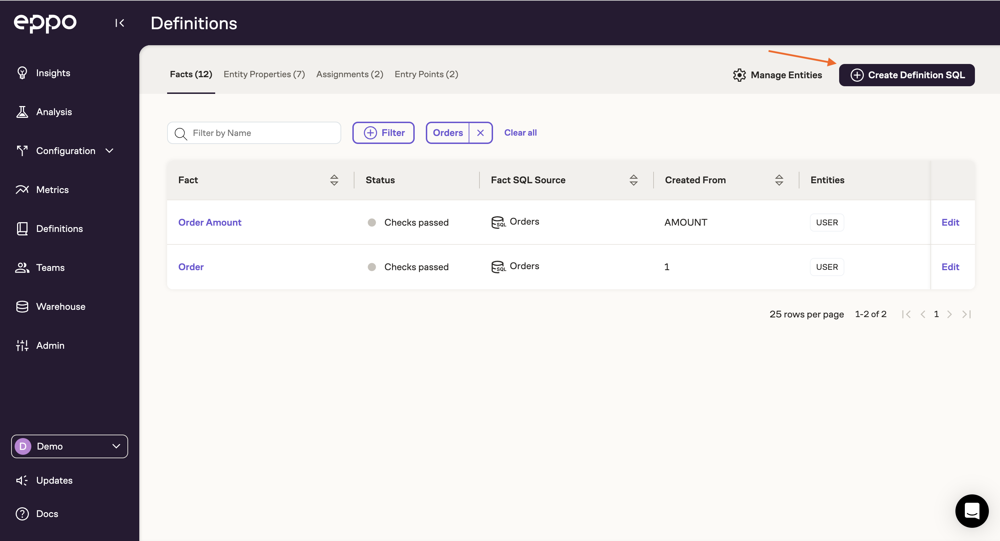
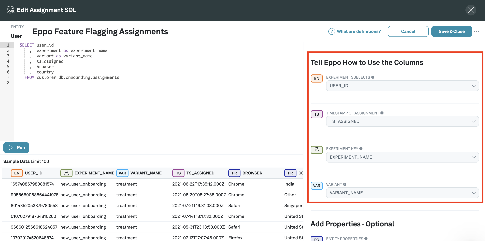
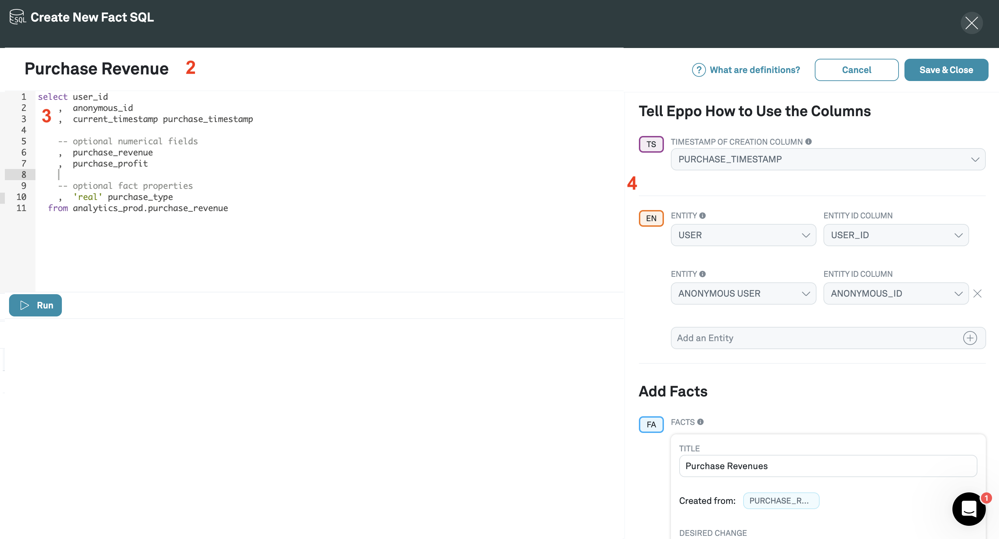
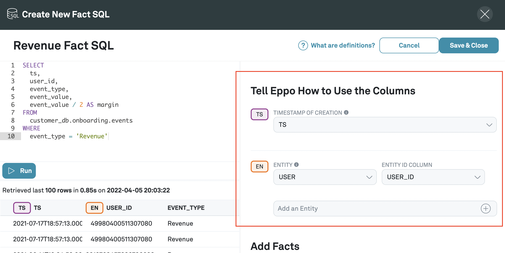
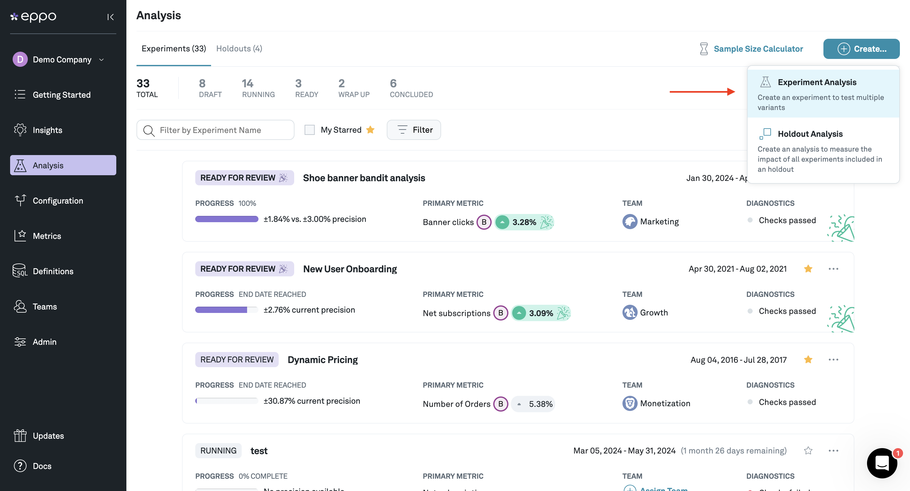
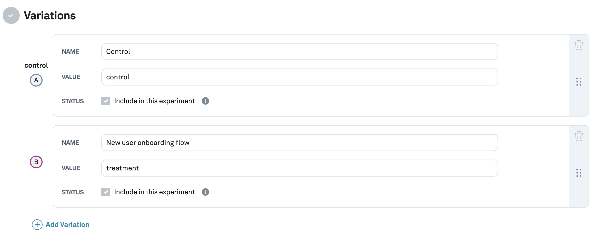

# Quickstart

Follow this quickstart to get your first experiment setup on Eppo in under 10 minutes

## Prep your data warehouse

This is also a good opportunity to think about

## Set up feature flagging

## Create Eppo account

## Connect your data warehouse

<!-- - [Connect to Snowflake]()
- [Connect to BigQuery]() -->

## Create Entity

1. Navigate to **Definitions**

2. Create a new entity

Click on **Manage Entities**

Then click on **+Create Entity** and give it a name

## Create an Assignment SQL

1. Click **Create Definition SQL**

3. Click **Assignment SQL**

4. Select the subject of the Assignment SQL

This should one of the entities you created.

In this case we are assigning users into different groups, so we choose **Users**

4. Name your Assignment SQL

5. Write SQL in the SQL editor to pull assignments from data warehouse

6. Click run

7. Annotate the columns that you've selected from the data warehouse

Eppo needs to know which columns correspond to experiment subject, timestamp of assignment, feature flag, and variant.

8. Make note of your feature flag name and variant names

Look at the value of the column you annotated as **FEATURE FLAG** and the values of the column that you annotated as **VARIANT**

Note the value of the **FEATURE FLAG** column; in this example it's `new_user_onboarding` - this is your feature flag name.

Note the values of the **VARIANT** column; in this example it's `control` and `treatment` - these are the names of your variants.

You will need these names further down in this quickstart so be sure to jot them down.

9. Adding optional dimensions

9. Save & Close

## Create a Fact SQL

Fact SQL's correspond to events that actually occurred.

1. Navigate to **Definitions**

2. Click **Create Definition SQL**

3. Click **Fact SQL**

4. Select the subject of the Fact SQL

This should one of the entities you created.

In this case we are assigning users into different groups, so we choose **Users**

5. Name your Fact SQL

6. Write SQL in the SQL editor to pull events data from the data warehouse

7. Annotate the columns that you've selected from the data warehouse

In the example above, Eppo has already automatically determined that the `timestamp of creation` column is `ts` and the relevant `entity id` column is `USER_ID`.

8. Add Facts

You'll want to add facts, one fact per column.

In the example above, we would like to measure the effect of the experiment on revenue.

In the data warehouse, every time there is a revenue event (that might be someone purchasing something,), that event is logged as a row in the data warehouse.

This event is translated into an integer value, which is the revenue amount, that can then be used as an Eppo fact and tracked in an experiment.

10. Save & Close

## Create metrics

1. Navigate to **Metrics**

2. Click **+Metric**

3. Select the subject of the User SQL

This should one of the entities you created.

In this case we are assigning users into different groups, so we choose **Users**

4. Select a fact

This should be one of the facts that you created in the step above, and should correspond to a metric that you want to track in an experiment.

5. Select an aggregation

The aggregation will aggregate over whatever the fact is measuring on a per-entity basis. So for example, if you select the `Revenue` fact and the `SUM` aggregation, the metric will be the total revenue for each user;, if you select the `Upgrades` fact and the `SUM` aggregation, the metric will be the total number of upgrades for each user, which should only be 1 across the board.

Eppo supports the following aggregations:

- SUM
- COUNT DISTINCT
- COUNT
- RETENTION
- CONVERSION

6. (Optional) Select a Filter

When you created an assignment SQL above, you may have also created additional dimensions, i.e. country or browser. These dimensions are now available under the **Definitions** > **Dimensions SQL**.

You can select any of the dimensions that you created in the dimensions definitions. In the example above, we just want to focus on upgrades from Canada.

7. Select a minimum detectable effect

The minimum detectable effect refers to the smallest effect you want to reliably detect in experiments. The higher the minimum detectable effect you set, the longer the experiment will take to reach conclusive results.

## Create an experiment

### Configure the experiment

1. Navigate to **Experiments** in the left-hand menu and click **+Experiment**

2. Fill out the **Create Experiment** Form

Give your experiment a name, start and end date.

3. Navigate to the **Set Up** tab and click the **Configure the Experiment** button

6. Select an assignment SQL from the definitions you created

7. Input feature flag name

When you created your assignment SQL, you should have made note of your feature flag name. In our case it's `new_user_onboarding`.

8. Input what percentage of traffic you want randomized into the experiment.

If you input 100%, 100% of the relevant entities (users in this case) will be included in the experiment.

9. Add the variants

When you created your assignment SQL, you should have made note of your variant names. In our case here it's `control` and `variant`.

You can go ahead and add each variant into the experiment here.

10. Select the traffic allocation you would like

The default is an even split between all the variants (including control), but you can also customize the allocation for unequal splits.

11. Click **Save Changes**

### Add metrics to experiment

1. Navigate to **Experiments** and click the **Overview** tab

You should have already configured your feature flag above, if you haven't, go do that first.

Under **Decision metrics**, you will see that [guardmail metrics](./building-experiments/experiments/guardrail-metrics.md) have already been included automatically.

4. Click **+Add metric** button

On the left hand of the modal, you will see a list of metrics that have been created that are attached to this set of experiment subjects.

You can select one of them to add to the experiment

5. Click **Save**

## Your experiment is now in progress!

Your experiment will likely take a few days to start outputing results.

