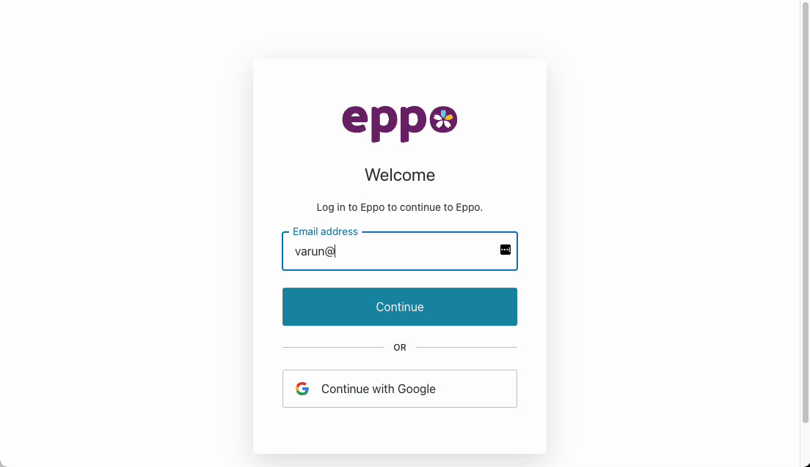

# Enterprise authentication

Eppo supports the following enterprise authentication options:

- SAML
- OpenID Connect
    - [Okta](./okta)
- Google Workspace
- Microsoft Azure AD
- ADFS
- LDAP
- Ping Federate

Follow the guides linked above or reach out to your Eppo team if you would like one of these options configured for your users.