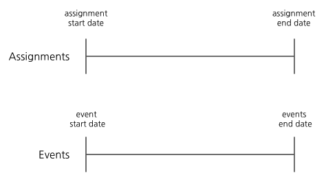
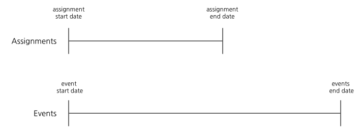

# Experiments with custom event dates

## Summary

When [creating an experiment](../experiments/building-experiments/experiments/creating-experiments.md), Eppo can analyze events which occur during or after randomization.

By default in Eppo, users are assigned (randomized) into an experiment and all events are tracked on the same timeline as assignment.

However, in certain cases, you may want events to be tracked well after randomization ends.

While uncommon, event dates should be extended past the assignment period if you wish to detect an effect that will appear long after treatment exposure.

### Example 1: Short-lived marketing campaign

Let's test the following: if we run a marketing campaign on our landing page for one day, do our customers  generate higher revenue for us over the next month?

Using distinct assignment and event periods, we should:
- Assign users for one day
- Track events for one month

If the assignment period matched the event period, then we'd be continually exposing the marketing campaign to users, which is not what we intended.

### Example 2: New user onboarding flow

A service is interested in testing whether a new onboarding flow will increase 90-day retention. One possible design could be the following:

- Assign users for two weeks (14 days)
- Track events for 104 days (14 days + 90 days)

This will allow Eppo to calculate out the rentention metric for the entire population. If the assignment period matched the event period (as is the default in Eppo), this could expose more users than necessary to a new onboarding flow without first understanding the long-term impact.
