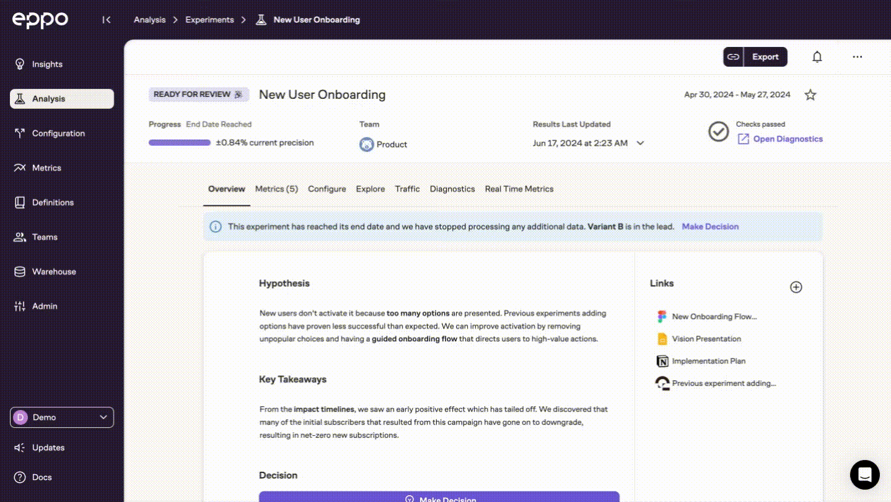
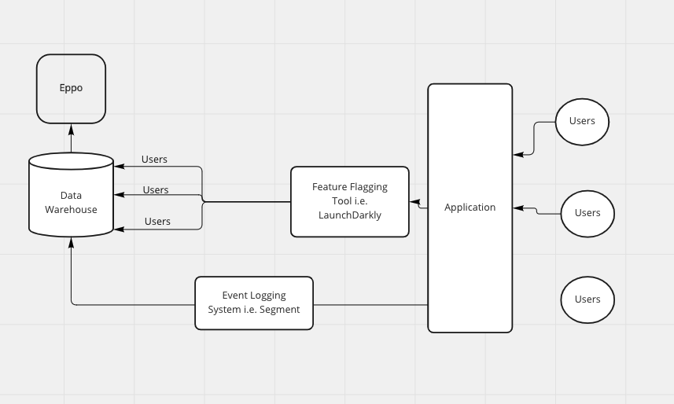

# What is Eppo

Eppo is a next-generation experimentation platform build right on top of your data warehouse.

# How Eppo Works

There are four pieces to Eppo:

1. **Use your feature flagging tool of choice to generate experiment data into your data warehouse**

2. **Connect your data warehouse**

   Currently Eppo supports:

- [Snowflake](./connecting-data/data-warehouses/connecting-to-snowflake.md)
- Redshift
- [BigQuery](./connecting-data/data-warehouses/connecting-to-bigquery.md)

3. **Build your experiments by writing SQL**

4. **Monitor your experiments' progress**

5. **Share experiment results with Eppo dashboards**

# Getting Started Resources

- [10 minute quickstart to getting up and running with Eppo](./quickstart.md)
- [From Feature Flag to Data Warehouse](../docs/connecting-data/feature-flagging/)
- [Connect your data warehouse to Eppo](../docs/connecting-data/data-warehouses/connecting-to-bigquery)
