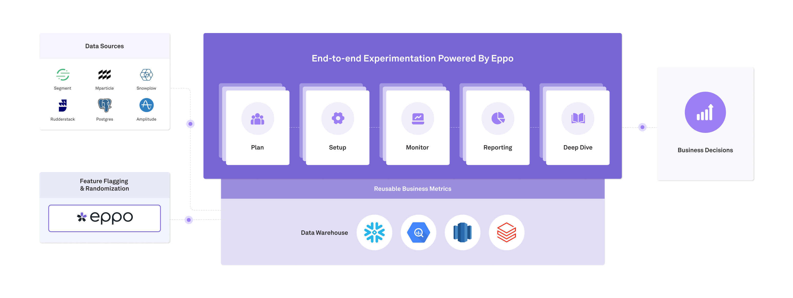

# What is Eppo?

Eppo is a next-generation feature flag and experimentation platform build right on top of your data warehouse:

We offer companies an end-to-end suite of experimentation tools, but let you decide which ones are right for you. Here are a few common ways teams use Eppo:

- For [**experiment analysis**](./experiment-quickstart) alongside another feature flagging tool such as LaunchDarkly.
- For [**feature flagging**](./feature-flag-quickstart) without experimentation.
- As an [**end-to-end experimentation platform**](./feature-flags/use-cases/experiment-assignment) - both feature flagging and analysis.

 

# How experiment analysis works

Eppo's analysis works is built on top of your data warehouse. Concretely, this means experiment results are computed within the warehouse without data ever leaving your system. As part of that process, intermediate and aggregate tables are always available in the warehouse for you to audit. In Eppo business metrics are defined in SQL, the same definitions that you use for business reporting.

Generating an experiment report on Eppo involves five pieces:

1. Use your feature flagging tool of choice to send experiment assignments into your data warehouse.
2. Connect Eppo to your data warehouse. Currently Eppo supports [Snowflake](../experiments/connecting-your-data/data-warehouses/connecting-to-snowflake), [Redshift](../experiments/connecting-your-data/data-warehouses/connecting-to-redshift), and [BigQuery](../experiments/connecting-your-data/data-warehouses/connecting-to-bigquery).
3. Build your experiments by writing SQL.
4. Monitor your experiments' progress.
5. Explore and share experiment results.

 

# Getting started resources

- [Your first experiment analysis](./experiment-quickstart)
- [Connect your data warehouse to Eppo](./experiments/connecting-your-data/data-warehouses/connecting-to-bigquery)
- [How the Eppo data pipeline works](./experiments/building-experiments/eppo-data-pipeline)
